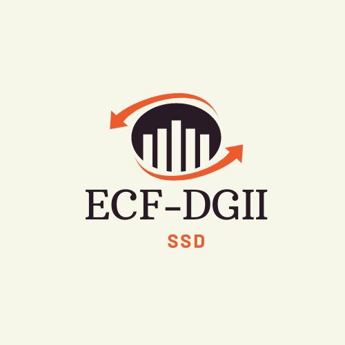
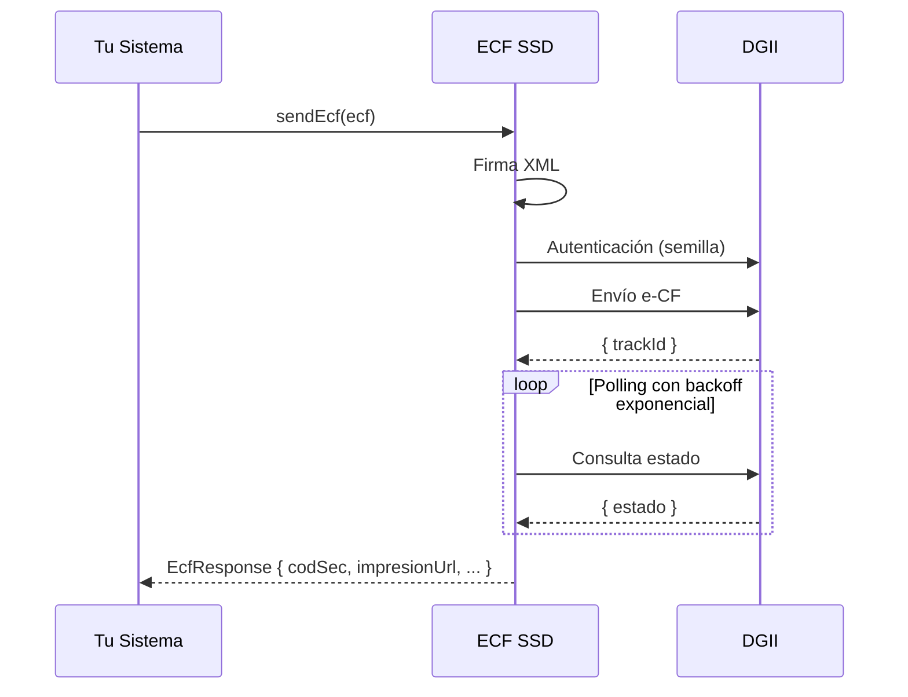
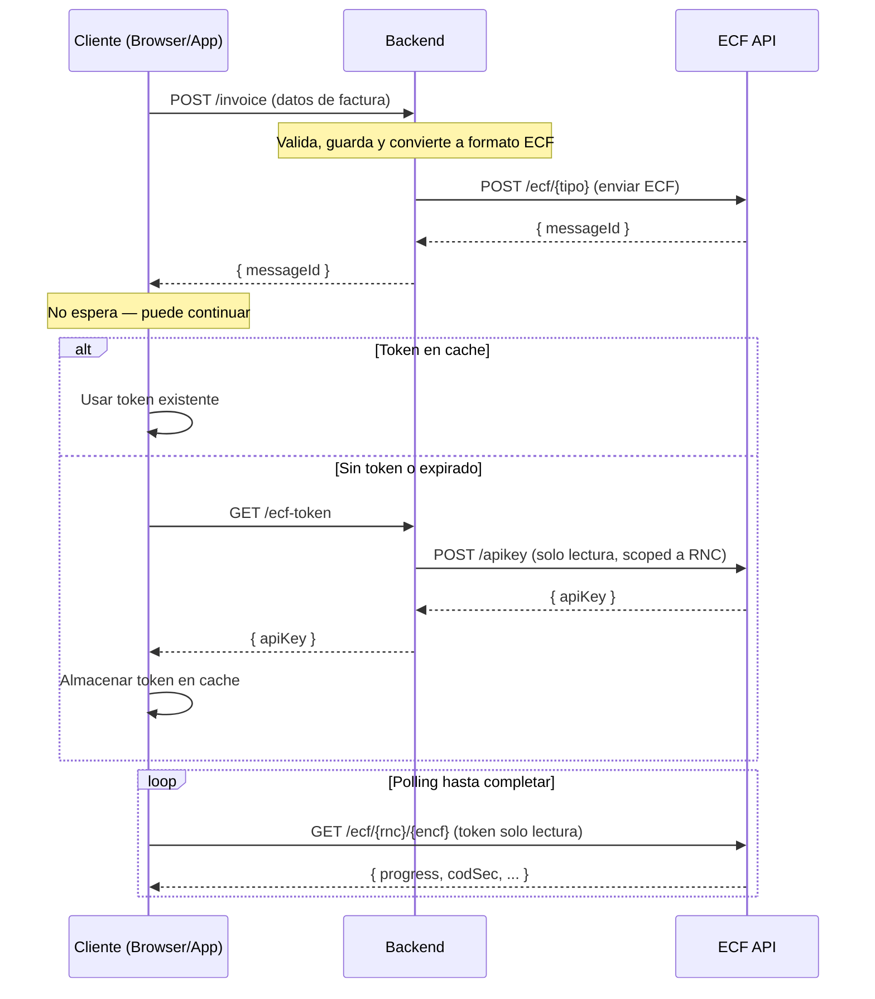

# DGII ECF - SDK Clients

> **¿Buscas la versión anterior (v2.0.1)?** Los paquetes .NET (`SSDDO.ECF_DGII.Models` / `SSDDO.ECF_DGII.SDK`) están disponibles en la rama [`2.0.1-legacy`](https://github.com/SSD-Smart-Software-Development-SRL/ecf_dgii/tree/2.0.1-legacy).

<p align="center">
  
</p>

<p align="center">
  SDKs oficiales para integrar la facturación electrónica (e-CF) en República Dominicana a través de <a href="https://ecf.ssd.com.do"><strong>ECF SSD</strong></a>.
</p>

| Plataforma | Paquete | Instalación | Docs |
|-----------|---------|-------------|------|
| .NET | [](https://www.nuget.org/packages/SSDDO.ECF_DGII.SDK) [](https://www.nuget.org/packages/SSDDO.ECF_DGII.SDK) | `dotnet add package SSDDO.ECF_DGII.SDK` | [README](.net/README.md) |
| TypeScript | [](https://www.npmjs.com/package/@ssddo/ecf-sdk) [](https://www.npmjs.com/package/@ssddo/ecf-sdk) | `npm install @ssddo/ecf-sdk` | [README](typescript/README.md) |
| React | [](https://www.npmjs.com/package/@ssddo/ecf-react) [](https://www.npmjs.com/package/@ssddo/ecf-react) | `npm install @ssddo/ecf-react` | [README](react/README.md) |
| Python | [](https://pypi.org/project/ecf-dgii/) [](https://pypi.org/project/ecf-dgii/) | `pip install ecf-dgii` | [README](python/README.md) |
| PHP | [](https://packagist.org/packages/ecfx/ecf-dgii-php) [](https://packagist.org/packages/ecfx/ecf-dgii-php) | `composer require ecfx/ecf-dgii-php` | [README](https://github.com/SSD-Smart-Software-Development-SRL/ecf-dgii-php) |
| Java | [](https://central.sonatype.com/artifact/dom.com.ssd.ecfx/ecf-dgii-sdk-java) | Ver [java/README.md](java/README.md) | [README](java/README.md) |
| Kotlin | [](https://central.sonatype.com/artifact/dom.com.ssd.ecfx/ecf-dgii-sdk-kotlin) | Ver [kotlin/README.md](kotlin/README.md) | [README](kotlin/README.md) |
| iOS/Swift | [Swift Package Manager](https://swift.org/package-manager/) | Ver [ios/README.md](ios/README.md) | [README](ios/README.md) |
| C++ | [vcpkg](https://vcpkg.io/) / [Conan](https://conan.io/) | Ver [C++/README.md](C++/README.md) | [README](C++/README.md) |

---

## Qué es ECF SSD

[ECF SSD](https://ecf.ssd.com.do) es una plataforma que simplifica la emisión de comprobantes fiscales electrónicos (e-CF) en República Dominicana. En vez de que cada empresa implemente todo el proceso de comunicación con la DGII (firmado XML, autenticación por semilla, manejo de certificados, reintentos, almacenamiento, etc.), **ECF SSD lo hace por ti**.

Tú solo envías el comprobante en JSON a través de estos SDKs, y el servicio se encarga de:

- Firmar el comprobante electrónicamente (XML signing con tu certificado digital)
- Autenticar con la DGII (semilla → token)
- Enviar el e-CF a la DGII
- Validar emisor-receptor
- Almacenar los comprobantes de forma segura
- Reintentar automáticamente en caso de fallos
- Gestionar tus certificados digitales

---

## Cómo Empezar

### Paso 1: Regístrate en ECF SSD

Visita [https://ecf.ssd.com.do](https://ecf.ssd.com.do) y crea tu cuenta.

### Paso 2: Obtén tu API Key

Genera tu API Key (JWT) desde el panel de ECF SSD. Este token es el que usarás para autenticarte con los SDKs durante el desarrollo y la certificación.

### Paso 3: Contacta a ECF SSD para la Integración

Contacta al equipo de ECF SSD para iniciar el proceso de integración y certificación de tu **sistema** (no de las empresas de tus clientes — la certificación es para tu plataforma). El equipo te guiará a través del proceso usando el ambiente de **certificación** (`Cert`).

### Paso 4: Usa Producción

Una vez que tu sistema esté integrado y certificado, podrás usar el ambiente de **producción** (`Prod`) para emitir comprobantes fiscales electrónicos reales para las empresas de tus clientes.

> **¿Vienes de otro proveedor?** ECF SSD soporta migración desde otros proveedores de facturación electrónica. Contacta al equipo para coordinar la transición.

### Paso 5: Integra con tu Sistema

Instala el SDK de tu lenguaje preferido y comienza a enviar comprobantes:

```csharp
// .NET
var client = new EcfClient(new EcfClientOptions
{
    ApiKey = "tu-jwt-token",
    Environment = EcfEnvironment.Prod
});

var ecf = new ECF
{
    Encabezado = new Encabezado
    {
        IdDoc = new IdDoc
        {
            TipoeCF = TipoeCFType.FacturaDeCreditoFiscalElectronica,
            Encf = "E310000000001"
        },
        Emisor = new Emisor
        {
            RncEmisor = "123456789",
            RazonSocialEmisor = "Mi Empresa SRL",
            DireccionEmisor = "Calle Principal #1, Santo Domingo",
            FechaEmision = DateTimeOffset.Now
        },
        Totales = new Totales { /* montos, ITBIS, etc. */ }
    },
    DetallesItems = new List<Item>
    {
        new Item
        {
            NombreItem = "Servicio de consultoría",
            IndicadorFacturacion = IndicadorFacturacionType.NoFacturable_18Percent,
            CantidadItem = 1,
            PrecioUnitarioItem = 10000.00,
            MontoItem = 10000.00
        }
    }
};

// Envía y espera el resultado — una sola llamada
EcfResponse resultado = await client.SendEcfAsync(ecf);
Console.WriteLine($"Estado: {resultado.Progress}");
Console.WriteLine($"Código seguridad: {resultado.CodSec}");
```

```typescript
// TypeScript
import { EcfClient } from 'ecf-dgii-client';

const client = new EcfClient({
  apiKey: 'tu-jwt-token',
  environment: 'prod',
});

const resultado = await client.sendEcf({
  encabezado: {
    idDoc: {
      tipoeCF: 'FacturaDeCreditoFiscalElectronica',
      encf: 'E310000000001',
    },
    emisor: {
      rncEmisor: '123456789',
      razonSocialEmisor: 'Mi Empresa SRL',
    },
    totales: { /* ... */ },
  },
  detallesItems: [
    {
      nombreItem: 'Servicio de consultoría',
      cantidadItem: 1,
      precioUnitarioItem: 10000.00,
      montoItem: 10000.00,
    }
  ],
});
```

```python
# Python
from ecf_dgii_client import EcfClient

client = EcfClient(
    api_key="tu-jwt-token",
    environment="prod",
)

resultado = client.send_ecf({
    "encabezado": {
        "idDoc": {
            "tipoeCF": "FacturaDeCreditoFiscalElectronica",
            "encf": "E310000000001",
        },
        "emisor": {
            "rncEmisor": "123456789",
            "razonSocialEmisor": "Mi Empresa SRL",
        },
    },
    "detallesItems": [
        {
            "nombreItem": "Servicio de consultoría",
            "cantidadItem": 1,
            "precioUnitarioItem": 10000.00,
            "montoItem": 10000.00,
        }
    ],
})
```

---

## Ambientes

| Ambiente | URL | Uso |
|----------|-----|-----|
| **Test** | `https://api.test.ecfx.ssd.com.do` | Desarrollo y pruebas internas |
| **Cert** | `https://api.cert.ecfx.ssd.com.do` | Proceso de certificación con la DGII |
| **Prod** | `https://api.prod.ecfx.ssd.com.do` | Producción |

## Autenticación

Todos los SDKs utilizan **JWT Bearer Token** para autenticarse. Puedes configurar el token de dos formas:

1. **Directamente en el código:** pasando el API Key al crear el cliente
2. **Variable de entorno:** `ECF_API_KEY` (todos los SDKs la leen automáticamente)

## Tipos de Comprobantes Soportados

| Tipo | Código | Ruta API |
|------|--------|----------|
| Factura de Crédito Fiscal Electrónica | E31 | `/ecf/31` |
| Factura de Consumo Electrónica | E32 | `/ecf/32` |
| Nota de Débito Electrónica | E33 | `/ecf/33` |
| Nota de Crédito Electrónica | E34 | `/ecf/34` |
| Compras Electrónico | E41 | `/ecf/41` |
| Gastos Menores Electrónico | E43 | `/ecf/43` |
| Regímenes Especiales Electrónico | E44 | `/ecf/44` |
| Gubernamental Electrónico | E45 | `/ecf/45` |
| Comprobante de Exportaciones Electrónico | E46 | `/ecf/46` |
| Comprobante para Pagos al Exterior Electrónico | E47 | `/ecf/47` |

## Cómo Funciona `sendEcf`

Todos los SDKs incluyen un método de alto nivel (`SendEcfAsync`, `sendEcf`, `send_ecf`) que encapsula toda la complejidad:



1. **Enrutamiento automático:** Determina el endpoint correcto (`/ecf/31`, `/ecf/32`, etc.) basándose en el `tipoeCF` del comprobante
2. **Envío:** POST al endpoint correspondiente
3. **Polling con backoff exponencial:** Consulta periódicamente el estado hasta que la DGII responda (`Finished` o `Error`)
4. **Resultado:** Retorna el `EcfResponse` con el estado final, código de seguridad, URL de impresión, etc.

## Respuesta (`EcfResponse`)

Al completarse el envío, recibes un `EcfResponse` con los datos necesarios para cumplir con los requisitos de impresión de la DGII:

| Campo | Descripción |
|-------|-------------|
| `ImpresionUrl` | URL para generar el código QR requerido por la DGII en el comprobante impreso |
| `CodSec` | Código de seguridad — debe aparecer en el comprobante impreso |
| `FechaFirma` | Fecha y hora de la firma digital del comprobante |
| `Estatus` | Estado DGII: `Aceptado`, `AceptadoCondicional`, `Rechazado` |
| `Progress` | Estado del procesamiento: `Queued`, `Sending`, `Polling`, `Finished`, `Error` |
| `Encf` | Número de comprobante fiscal electrónico (eNCF) |
| `Mensaje` | Mensaje de respuesta de la DGII |
| `Errors` | Detalle de errores (si los hay) |
| `MontoTotal` | Monto total del comprobante |
| `SecuenciaUtilizada` | Indica si la secuencia fue utilizada |

### QR e Impresión

La DGII requiere que todo comprobante impreso incluya un **código QR**. El campo `ImpresionUrl` contiene la URL que debe codificarse como QR. Adicionalmente, el `CodSec` (código de seguridad) y la `FechaFirma` deben aparecer impresos en el comprobante.

```csharp
// .NET
EcfResponse resultado = await client.SendEcfAsync(ecf);

string urlQr = resultado.ImpresionUrl;          // codificar como QR
string codigoSeguridad = resultado.CodSec;      // imprimir en el comprobante
DateTimeOffset fechaFirma = resultado.FechaFirma; // fecha de firma digital
```

```typescript
// TypeScript
const resultado = await client.sendEcf(ecf);

const urlQr = resultado.impresionUrl;          // codificar como QR
const codigoSeguridad = resultado.codSec;      // imprimir en el comprobante
const fechaFirma = resultado.fechaFirma;       // fecha de firma digital
```

```python
# Python
resultado = client.send_ecf(ecf)

url_qr = resultado.impresion_url              # codificar como QR
codigo_seguridad = resultado.cod_sec          # imprimir en el comprobante
fecha_firma = resultado.fecha_firma           # fecha de firma digital
```

## Arquitectura Backend / Frontend



### Flujo detallado

1. El **cliente** (browser/app) envía los datos de la factura al **backend** (`POST /invoice`, `/order`, `/sale`)
2. El **backend** valida, guarda y convierte la factura interna al formato ECF
3. El **backend** envía el ECF a la API de ECF SSD (`POST /ecf/{tipo}`) y recibe un `messageId`
4. El **backend** retorna el `messageId` al cliente — **el cliente no espera**, puede continuar
5. Cuando el cliente necesita consultar el estado del ECF, usa `EcfFrontendClient` que internamente:
   - Verifica si hay un **token de solo lectura** en cache
   - Si **no existe o expiró**: llama a `getToken()` (que el consumidor provee — típicamente un `fetch('/ecf-token')` a su backend), luego llama a `cacheToken(token)` para almacenarlo
   - Si la API retorna **401**: automáticamente llama a `getToken()` de nuevo, actualiza el cache, y reintenta
6. El cliente hace **polling** directamente contra la API de ECF SSD (`GET /ecf/{rnc}/{encf}`) hasta que `progress` sea `Finished`

### Por qué este patrón

- **Descarga el backend:** Las consultas de estado (polling) las hace el cliente directamente contra ECF SSD.
- **Seguridad:** El token del cliente es de solo lectura y está limitado al tenant/RNC. No puede enviar comprobantes ni modificar datos.
- **Tiempo real:** El cliente puede hacer polling del estado sin depender del backend.
- **Token automático:** `EcfFrontendClient` maneja el ciclo de vida del token — cache, refresh en 401, y reintento.

### Ejemplo Backend (Node.js / TypeScript)

```typescript
import { EcfClient } from '@ssddo/ecf-sdk';

const ecfClient = new EcfClient({
  apiKey: process.env.ECF_BACKEND_TOKEN,
  environment: 'prod',
});

// Tu endpoint de facturación — lógica de negocio + envío a ECF SSD
app.post('/api/v1/invoices', async (req, res) => {
  const invoice = await validateAndSave(req.body);
  const ecf = convertToEcf(invoice);
  const { data } = await ecfClient.raw.POST('/ecf/31', { body: ecf });
  await updateInvoice(invoice.id, { messageId: data.messageId });
  res.json({ id: invoice.id, messageId: data.messageId, rnc: ecf.encabezado.emisor.rncEmisor, encf: ecf.encabezado.idDoc.encf });
});

// Generar token de solo lectura para el cliente
app.get('/api/v1/ecf-token', async (req, res) => {
  const { data } = await ecfClient.createApiKey({ rnc: tenant.rnc });
  res.json({ apiKey: data.token });
});
```

### Ejemplo Frontend (React)

```tsx
import { createEcfFrontendReactClient } from '@ssddo/ecf-react';

// 1. Crear cliente de solo lectura (getToken se llama automáticamente)
const { $api } = createEcfFrontendReactClient({
  getToken: async () => {
    const res = await fetch('/api/v1/ecf-token');
    const { apiKey } = await res.json();
    return apiKey;
  },
  environment: 'prod',
});

// 2. Enviar la factura al backend
function EnviarFactura() {
  const handleSubmit = async (invoiceData) => {
    const res = await fetch('/api/v1/invoices', {
      method: 'POST',
      body: JSON.stringify(invoiceData),
    });
    const { messageId, rnc, encf } = await res.json();
    // El cliente no espera — navega a la página de estado
    navigate(`/ecf-status/${rnc}/${encf}`);
  };
}

// 3. Polling automático del estado del ECF
function EstadoEcf({ rnc, encf }: { rnc: string; encf: string }) {
  const { data } = $api.useQuery('get', '/ecf/{rnc}/{encf}', {
    params: { path: { rnc, encf } },
    refetchInterval: 3000,
  });

  if (data?.progress === 'Finished') {
    return (
      <div>
        <p>Comprobante aceptado</p>
        <p>Código seguridad: {data.codSec}</p>
        <QRCode value={data.impresionUrl} />
      </div>
    );
  }

  return <p>Procesando... ({data?.progress})</p>;
}
```

## Funcionalidades Adicionales del API

Además de enviar comprobantes, los SDKs exponen todos los endpoints del API:

| Funcionalidad | Descripción |
|--------------|-------------|
| **Empresas** | Crear, consultar y eliminar empresas registradas |
| **Certificados** | Subir y consultar certificados digitales |
| **Consulta de e-CF** | Buscar comprobantes por RNC, eNCF, fecha, monto, etc. |
| **Aprobación Comercial** | Enviar aprobación/rechazo comercial (ACECF) |
| **Anulación de Rangos** | Solicitar anulación de secuencias de eNCF |
| **Consultas DGII** | Directorio, estado, resultado, timbre, RFCE, track IDs |
| **Estatus de Servicios** | Verificar disponibilidad de servicios DGII |
| **Ventanas de Mantenimiento** | Consultar ventanas de mantenimiento programadas |
| **API Keys** | Crear API keys para acceso programático |

## Documentación por Lenguaje

Cada SDK tiene su propia documentación con ejemplos específicos:

| SDK | Documentación |
|-----|--------------|
| .NET | [.net/README.md](.net/README.md) |
| TypeScript | [typescript/README.md](typescript/README.md) |
| Python | [python/README.md](python/README.md) |
| PHP | [ecf-dgii-php](https://github.com/SSD-Smart-Software-Development-SRL/ecf-dgii-php) |
| Java | [java/README.md](java/README.md) |
| Kotlin | [kotlin/README.md](kotlin/README.md) |
| iOS/Swift | [ios/README.md](ios/README.md) |
| C++ | [C++/README.md](C++/README.md) |
| React | [react/README.md](react/README.md) |

## Migración desde versiones anteriores

Si usabas los paquetes `SSDDO.ECF_DGII.Models` y `SSDDO.ECF_DGII.SDK` v1/v2, consulta la [guía de migración en el README de .NET](.net/README.md#migración-desde-v2).

**En resumen:** ya no necesitas implementar firmado XML, autenticación por semilla, manejo de certificados, ni reintentos. Todo eso lo hace ECF SSD.

## Probar el API con Bruno

El repositorio incluye colecciones abiertas de [Bruno](https://www.usebruno.com/) (open source) para probar el API directamente sin escribir código:

| Colección | Archivo | Descripción |
|-----------|---------|-------------|
| **ECF DGII API** | [`bruno/ecf-dgii-api.json`](bruno/ecf-dgii-api.json) | API principal — comprobantes, empresas, certificados, DGII, etc. |
| **ECF Recepcion API** | [`bruno/ecf-recepcion-api.json`](bruno/ecf-recepcion-api.json) | API de recepción emisor-receptor |

### Cómo usar

1. Instala [Bruno](https://www.usebruno.com/downloads)
2. Abre Bruno y selecciona **Import Collection**
3. Selecciona **Bruno Collection** e importa el archivo `.json` deseado
4. Selecciona el ambiente (**Test**, **Cert**, o **Prod**)
5. Configura tu API Key en las variables del ambiente
6. Envía requests

Cada colección incluye 3 ambientes preconfigurados (Test, Cert, Prod) con las URLs correctas.

## Soporte

- Documentación: [https://ecf.ssd.com.do](https://ecf.ssd.com.do)
- Issues: [GitHub Issues](https://github.com/SSD-Smart-Software-Development-SRL/ecf_dgii/issues)

____

🇩🇴 Hecho con plátano power

_© Smart Software Development SSD SRL 2026_
