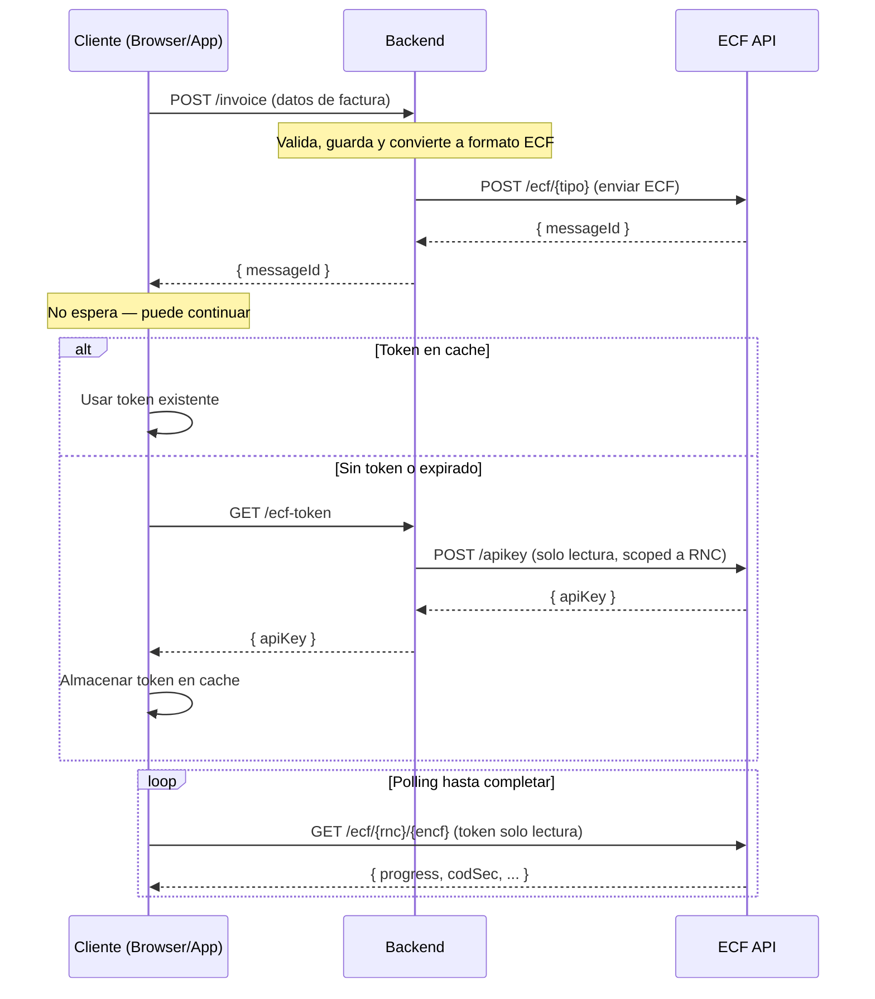

# Standardize Architecture Documentation & Frontend Client Interface Across All SDKs

> **For agentic workers:** REQUIRED SUB-SKILL: Use superpowers:subagent-driven-development (recommended) or superpowers:executing-plans to implement this plan task-by-task. Steps use checkbox (`- [ ]`) syntax for tracking.

**Goal:** Fix the architecture section in all 9 SDK READMEs (TypeScript, React, .NET, Python, Java, Kotlin, C++, iOS, PHP) and implement a proper `createEcfFrontendClient` factory with built-in token management (getToken + cacheToken callbacks) in every library.

**Architecture:** The frontend client handles token lifecycle automatically. The consumer only provides a `getToken` callback (how to fetch a new token from their backend) and optionally a `cacheToken` callback (how to persist it). The library handles cache checks, expiration, 401 retries, and re-fetching internally.

**Tech Stack:** TypeScript, React, C#, Python, Java, Kotlin, C++, Swift, PHP

---

## Part A: Frontend Client Interface Design

### Core interface (all languages)

Every library must implement a `createEcfFrontendClient` (or equivalent factory) that accepts:

```
config:
  getToken: async () => string       # REQUIRED — user provides how to fetch a new token from their backend
  cacheToken: async (token) => void  # OPTIONAL — how to persist the token. Has a sensible default per language.
  environment: 'test' | 'cert' | 'prod'  # OPTIONAL — defaults to 'test'
  baseUrl: string                    # OPTIONAL — overrides environment
```

**Behavior:**
1. On first API call, check if there's a cached token
2. If no cached token → call `getToken()` → call `cacheToken(token)` → use token
3. If API returns 401 → call `getToken()` → call `cacheToken(token)` → retry
4. The consumer NEVER deals with cache logic directly — only with how to fetch a fresh token

### Default `cacheToken` per language

| Language | Default cacheToken behavior |
|----------|---------------------------|
| TypeScript | `localStorage.setItem('ecf-token', token)` / `localStorage.getItem('ecf-token')` |
| React | Same as TypeScript (localStorage) |
| .NET | Encrypted file on disk via `DataProtectionProvider` or simple AES + random key |
| Python | Encrypted file on disk (simple Fernet encryption with auto-generated key) |
| Java | Encrypted file on disk (AES with auto-generated key stored alongside) |
| Kotlin | Same as Java |
| C++ | Encrypted file on disk (simple XOR or AES with auto-generated key) |
| iOS/Swift | Keychain storage |
| PHP | Encrypted file on disk (openssl_encrypt with auto-generated key) |

### What the consumer writes (React example)

```tsx
const { $api } = createEcfFrontendReactClient({
  getToken: async () => {
    const res = await fetch('/api/v1/ecf-token');
    const { apiKey } = await res.json();
    return apiKey;
  },
  environment: 'prod',
});

// That's it. Token caching, refresh on 401, etc. is handled internally.
function EstadoEcf({ rnc, encf }: { rnc: string; encf: string }) {
  const { data } = $api.useQuery('get', '/ecf/{rnc}/{encf}', {
    params: { path: { rnc, encf } },
    refetchInterval: 3000,
  });

  if (data?.progress === 'Finished') {
    return <p>Comprobante aceptado — código: {data.codSec}</p>;
  }
  return <p>Procesando... ({data?.progress})</p>;
}
```

### What the consumer writes (Python example — non-browser)

```python
from ecf_dgii import create_frontend_client

frontend = create_frontend_client(
    get_token=lambda: requests.get("https://my-backend/api/v1/ecf-token").json()["apiKey"],
    environment="prod",
    # cache_token defaults to encrypted file on disk — override if needed:
    # cache_token=lambda token: redis.set("ecf-token", token),
)

ecf = await frontend.query_ecf("131880681", "E310000051630")
```

---

## Part B: Canonical Mermaid Diagram

This exact diagram goes into every README identically:



## Part C: Canonical "Flujo detallado" Text

This exact text goes into every README after the diagram:

```markdown
### Flujo detallado

1. El **cliente** (browser/app) envía los datos de la factura al **backend** (`POST /invoice`, `/order`, `/sale`)
2. El **backend** valida, guarda y convierte la factura interna al formato ECF
3. El **backend** envía el ECF a la API de ECF SSD (`POST /ecf/{tipo}`) y recibe un `messageId`
4. El **backend** retorna el `messageId` al cliente — **el cliente no espera**, puede continuar
5. Cuando el cliente necesita consultar el estado del ECF, usa `EcfFrontendClient` que internamente:
   - Verifica si hay un **token de solo lectura** en cache
   - Si **no existe o expiró**: llama a `getToken()` (que el consumidor provee — típicamente un `fetch('/ecf-token')` a su backend), luego llama a `cacheToken(token)` para almacenarlo
   - Si la API retorna **401**: automáticamente llama a `getToken()` de nuevo, actualiza el cache, y reintenta
6. El cliente hace **polling** directamente contra la API de ECF SSD (`GET /ecf/{rnc}/{encf}`) hasta que `progress` sea `Finished`
```

## Rules for all tasks

1. **Heading level**: Use `## Arquitectura Backend / Frontend` (level 2) in ALL READMEs. Normalize any `###` to `##`.
2. **Remove cross-references**: Delete any "Ver el README principal" or "Consulta el README principal" lines. Each README is standalone.
3. **Remove `sendEcf` blockquote**: Delete the `> **sendEcf**...` note from architecture sections.
4. **Terminology**: Use "cliente" consistently (matching the diagram participant), not "frontend".
5. **Do NOT commit** the `docs/superpowers/` directory.

---

## Files to Modify

### README updates (9 files):
- `react/README.md`
- `typescript/README.md`
- `.net/README.md`
- `python/README.md`
- `java/README.md`
- `kotlin/README.md`
- `C++/README.md`
- `ios/README.md`
- `php/README.md` ← **NEW — PHP SDK exists but was missed**

### Code changes — new `createEcfFrontendClient` factory with token management (9 libraries):

| Library | File to modify/create | Factory name |
|---------|----------------------|--------------|
| React | `react/src/hooks.ts` | `createEcfFrontendReactClient` — update to accept `getToken`/`cacheToken` |
| TypeScript | `typescript/src/client.ts` | `createFrontendClient` — update to accept `getToken`/`cacheToken` |
| .NET | `.net/EcfDgii.Client/EcfFrontendClient.cs` | Update constructor to accept `Func<Task<string>> getToken` + `Func<string, Task> cacheToken` |
| Python | `python/ecf_dgii/frontend_client.py` | Update `__init__` to accept `get_token` + `cache_token` callables |
| Java | `java/src/main/java/.../EcfFrontendClient.java` | Update Builder to accept `Supplier<String> getToken` + `Consumer<String> cacheToken` |
| Kotlin | `kotlin/src/main/kotlin/.../EcfFrontendClient.kt` | Update config to accept `getToken: suspend () -> String` + `cacheToken: suspend (String) -> Unit` |
| C++ | `C++/include/ecf-dgii-client/EcfClient.h` | Update `EcfFrontendClient` to accept `std::function<std::string()>` callbacks |
| iOS | `ios/Sources/EcfDgiiClient/EcfFrontendClient.swift` | Update init to accept `getToken: @Sendable () async throws -> String` + `cacheToken` |
| PHP | TBD — need to check if PHP SDK exists in repo or is external |

---

### Task 1: Update React — code + README

**Files:**
- Modify: `react/src/hooks.ts` — update `createEcfFrontendReactClient` to accept `getToken`/`cacheToken`
- Modify: `react/src/index.ts` — update exports if needed
- Modify: `react/README.md` — replace architecture section

**Section boundaries (README):** Replace from `## Arquitectura Backend / Frontend` up to (but not including) `## Uso fuera de React`

- [ ] **Step 1: Update `createEcfFrontendReactClient` in hooks.ts**

New interface:
```typescript
export interface EcfFrontendReactClientConfig {
  getToken: () => Promise<string>;
  cacheToken?: (token: string) => Promise<void>;
  baseUrl?: string;
  environment?: Environment;
}
```

Default `cacheToken`: localStorage get/set with key `'ecf-token'`.

The function should:
- Create the fetch client with a middleware that:
  - Checks cached token first (via localStorage or custom cacheToken)
  - If no token, calls `getToken()`, then `cacheToken(token)`
  - On 401 response, calls `getToken()` again, updates cache, retries
- Return `{ $api }` with only `useQuery`, `useSuspenseQuery`, `queryOptions`

- [ ] **Step 2: Update README architecture section**

Replace with canonical mermaid diagram + flujo detallado + React-specific example (from Part A above).

- [ ] **Step 3: Build and verify**

Run: `cd react && pnpm build`

---

### Task 2: Update TypeScript — code + README

**Files:**
- Modify: `typescript/src/client.ts` — update `EcfFrontendClient` and `createFrontendClient`
- Modify: `typescript/README.md` — replace architecture section

**Section boundaries (README):** Replace from `## Arquitectura Backend / Frontend` up to (but not including) `## Acceso directo al cliente`

- [ ] **Step 1: Update `EcfFrontendClient` in client.ts**

New config interface:
```typescript
export interface EcfFrontendClientConfig {
  getToken: () => Promise<string>;
  cacheToken?: (token: string) => Promise<void>;
  getCachedToken?: () => Promise<string | null>;
  baseUrl?: string;
  environment?: Environment;
}
```

Defaults: `cacheToken` → localStorage.setItem, `getCachedToken` → localStorage.getItem.

- [ ] **Step 2: Update README architecture section**

Replace with canonical diagram + flujo + TypeScript backend/frontend examples.

- [ ] **Step 3: Build and verify**

Run: `cd typescript && pnpm build`

---

### Task 3: Update .NET — code + README

**Files:**
- Modify: `.net/EcfDgii.Client/EcfFrontendClient.cs`
- Modify: `.net/README.md`

**Section boundaries (README):** Replace from `## Arquitectura Backend / Frontend` up to (but not including) `## Acceso Directo al API`

- [ ] **Step 1: Update `EcfFrontendClient` to accept token callbacks**
- [ ] **Step 2: Update README architecture section**
- [ ] **Step 3: Verify build**: `dotnet build .net/EcfDgii.Client/`

---

### Task 4: Update Python — code + README

**Files:**
- Modify: `python/ecf_dgii/frontend_client.py`
- Modify: `python/README.md`

**Section boundaries (README):** Replace from `### Arquitectura Backend / Frontend` (normalize to `##`) up to (but not including) `### Gestión de empresas`

- [ ] **Step 1: Update `EcfFrontendClient` to accept `get_token`/`cache_token` callables**
- [ ] **Step 2: Update README architecture section**

---

### Task 5: Update Java — code + README

**Files:**
- Modify: `java/src/main/java/.../EcfFrontendClient.java`
- Modify: `java/README.md`

**Section boundaries (README):** Replace from `## Arquitectura Backend / Frontend` up to (but not including) `## Acceso directo a la API`

- [ ] **Step 1: Update `EcfFrontendClient.Builder` to accept `getToken`/`cacheToken`**
- [ ] **Step 2: Update README architecture section**

---

### Task 6: Update Kotlin — code + README

**Files:**
- Modify: `kotlin/src/main/kotlin/.../EcfFrontendClient.kt`
- Modify: `kotlin/README.md`

**Section boundaries (README):** Replace from `## Arquitectura Backend / Frontend` up to (but not including) `## Entornos`

- [ ] **Step 1: Update `EcfFrontendClient` to accept suspend callbacks**
- [ ] **Step 2: Update README architecture section**

---

### Task 7: Update C++ — code + README

**Files:**
- Modify: `C++/include/ecf-dgii-client/EcfClient.h` and `C++/src/EcfClient.cpp`
- Modify: `C++/README.md`

**Section boundaries (README):** Replace from `### Arquitectura Backend / Frontend` (normalize to `##`) up to (but not including) `### Acceso directo a la API`

- [ ] **Step 1: Update `EcfFrontendClient` to accept `std::function` callbacks**
- [ ] **Step 2: Update README architecture section**

---

### Task 8: Update iOS/Swift — code + README

**Files:**
- Modify: `ios/Sources/EcfDgiiClient/EcfFrontendClient.swift`
- Modify: `ios/README.md`

**Section boundaries (README):** Replace from `### Arquitectura Backend / Frontend` (normalize to `##`) up to (but not including) `### Acceso directo a la API`

- [ ] **Step 1: Update `EcfFrontendClient` to accept async closures**

Default `cacheToken`: Keychain storage.

- [ ] **Step 2: Update README architecture section**

---

### Task 9: Add/Update PHP — code + README

**Files:**
- TBD — first check if PHP SDK exists in repo or is external
- If external: skip code changes, only document the pattern in a README
- If in repo: implement `EcfFrontendClient` with `getToken`/`cacheToken`

**Section boundaries (README):** Full architecture section

- [ ] **Step 1: Determine PHP SDK location and implement accordingly**
- [ ] **Step 2: Write/update README with canonical diagram + PHP example**

---

### Task 10: Final consistency check and commit

- [ ] **Step 1: Verify all 9 READMEs have the identical mermaid diagram**

```bash
grep -c "POST /ecf/{tipo}" react/README.md typescript/README.md .net/README.md python/README.md java/README.md kotlin/README.md C++/README.md ios/README.md php/README.md
```

- [ ] **Step 2: Verify no cross-references remain**

```bash
grep -r "README principal" react/README.md typescript/README.md .net/README.md python/README.md java/README.md kotlin/README.md C++/README.md ios/README.md
```

- [ ] **Step 3: Verify heading levels are normalized to `##`**

- [ ] **Step 4: Report to user for review before committing**

Do NOT commit or push. Present a summary of all changes to the user for approval first.

---

## Verification

1. All 9 READMEs have the identical mermaid diagram with `POST /ecf/{tipo}`
2. All 9 READMEs have the identical "Flujo detallado" that mentions `getToken()` and `cacheToken()`
3. Each README has language-specific code examples showing `getToken` callback usage
4. The diagram starts with "Cliente → Backend: POST /invoice"
5. The diagram shows the client does NOT wait after receiving messageId
6. The diagram shows the token cache check + 401 retry flow
7. The diagram shows the polling loop
8. All architecture section headings are `##` level
9. No cross-references to "README principal" remain
10. React + TypeScript `createEcfFrontendClient` accept `getToken`/`cacheToken` callbacks
11. All other languages have equivalent callback interfaces with sensible defaults
12. `docs/superpowers/` is NOT committed
