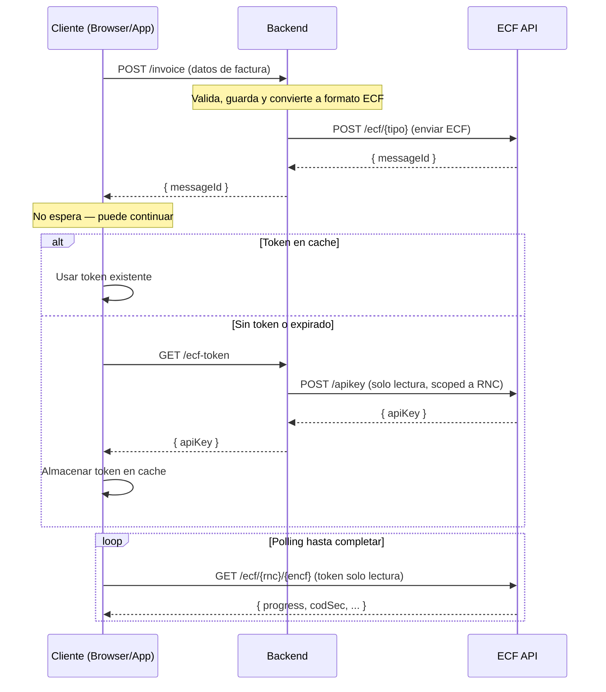

# EcfDgiiClient

SDK de Swift para la **API de ECF DGII** — procesamiento de comprobantes fiscales electrónicos (e-CF) de República Dominicana.

Certificado por la DGII. Compatible con iOS, macOS, tvOS y watchOS.

## Instalación

### Swift Package Manager (recomendado)

Agrega a tu `Package.swift`:

```swift
dependencies: [
    .package(url: "https://github.com/SSD-Smart-Software-Development-SRL/ecf_dgii.git", from: "0.1.0")
]
```

O en Xcode: **File > Add Package Dependencies** e ingresa la URL del repositorio.

### CocoaPods

```ruby
pod 'EcfDgiiClient', '~> 0.1.0'
```

## Inicio rápido

```swift
import EcfDgiiClient

// Inicializar el cliente
let client = EcfClient(
    apiKey: "tu-token-jwt-bearer",
    environment: .prod  // .test, .cert o .prod
)

// Enviar un ECF con enrutamiento automático y polling
let ecf = ECF(
    encabezado: Encabezado(
        version: .e10,
        idDoc: IdDoc(
            tipoeCF: .facturaDeCreditoFiscalElectronica,
            encf: "E310000000001"
        ),
        emisor: Emisor(
            rncEmisor: "123456789",
            razonSocialEmisor: "Mi Empresa SRL",
            direccionEmisor: "Santo Domingo"
        ),
        totales: totales
    ),
    detallesItems: items
)

do {
    let result = try await client.sendEcf(ecf: ecf)
    print("ECF aceptado: \(result.encf), estado: \(result.estatus)")
} catch let error as EcfProcessingError {
    print("ECF rechazado: \(error.message)")
    print("Respuesta DGII: \(error.response)")
}
```

## Características

### Cliente de alto nivel (`EcfClient`)

`EcfClient` proporciona una interfaz simplificada que maneja:

- **Enrutamiento automático** — determina el endpoint correcto (31-47) a partir de `encabezado.idDoc.tipoeCF`
- **Polling con backoff exponencial** — espera a que la DGII termine de procesar
- **Manejo de errores** — lanza `EcfProcessingError` con la respuesta completa de la DGII en caso de rechazo
- **Soporte de cancelación** — mediante concurrencia estructurada de Swift (`Task.cancel()`)

```swift
// Opciones de polling personalizadas
let options = PollingOptions(
    initialDelay: 2.0,      // segundos
    maxDelay: 60.0,          // máximo de segundos entre polls
    maxRetries: 30,
    backoffMultiplier: 1.5,
    timeout: 300             // timeout total en segundos
)

let result = try await client.sendEcf(ecf: ecf, pollingOptions: options)
```

## Arquitectura Backend / Frontend



### Flujo detallado

1. El **cliente** (browser/app) envía los datos de la factura al **backend** (`POST /invoice`, `/order`, `/sale`)
2. El **backend** valida, guarda y convierte la factura interna al formato ECF
3. El **backend** envía el ECF a la API de ECF SSD (`POST /ecf/{tipo}`) y recibe un `messageId`
4. El **backend** retorna el `messageId` al cliente — **el cliente no espera**, puede continuar
5. Cuando el cliente necesita consultar el estado del ECF, usa `EcfFrontendClient` que internamente:
   - Verifica si hay un **token de solo lectura** en cache (Keychain por defecto)
   - Si **no existe o expiró**: llama a `getToken()` (que el consumidor provee — típicamente un request a su backend), luego llama a `cacheToken(token)` para almacenarlo
   - Si la API retorna **401**: automáticamente llama a `getToken()` de nuevo, actualiza el cache, y reintenta
6. El cliente hace **polling** directamente contra la API de ECF SSD (`GET /ecf/{rnc}/{encf}`) hasta que `progress` sea `Finished`

### Ejemplo: Frontend (con `EcfFrontendClient`)

```swift
// 1. Enviar la factura al backend
let (invoiceData, _) = try await URLSession.shared.data(for: invoiceRequest)
let result = try JSONDecoder().decode(InvoiceResult.self, from: invoiceData)
// El cliente no espera — puede continuar con otras operaciones

// 2. Crear cliente de solo lectura (getToken se llama automáticamente)
let frontend = EcfFrontendClient(
    getToken: {
        let (data, _) = try await URLSession.shared.data(from: URL(string: "https://my-backend/api/v1/ecf-token")!)
        let json = try JSONDecoder().decode(TokenResponse.self, from: data)
        return json.apiKey
    },
    environment: .prod
    // cacheToken usa Keychain por defecto
)

// 3. Consultar el estado del ECF
let ecf = try await frontend.queryEcf(rnc: result.rnc, encf: result.encf)
let ecfs = try await frontend.searchEcfs(rnc: result.rnc)
```

### Acceso directo a la API

Todos los endpoints generados están disponibles mediante las clases estáticas de la API:

```swift
// Operaciones de empresa
let companies = try await CompanyAPI.getCompanies(apiConfiguration: client.apiConfiguration)
let company = try await CompanyAPI.getCompanyByRnc(rnc: "123456789", apiConfiguration: client.apiConfiguration)

// Consultas ECF
let ecfs = try await EcfAPI.searchEcfs(rnc: "123456789", apiConfiguration: client.apiConfiguration)
let status = try await EcfAPI.queryEcf(rnc: "123456789", encf: "E310000000001", apiConfiguration: client.apiConfiguration)

// Servicios DGII
let directorio = try await DgiiAPI.consultaDirectorioListado(rnc: "123456789", apiConfiguration: client.apiConfiguration)
let estado = try await DgiiAPI.consultaEstado(rnc: "123456789", rncEmisor: "...", ncfElectronico: "...", rncComprador: "...", codigoSeguridad: "...", apiConfiguration: client.apiConfiguration)

// Recepción
let requests = try await RecepcionAPI.searchEcfReceptionRequests(apiConfiguration: client.apiConfiguration)
```

### Entornos

| Entorno | URL base |
|---|---|
| `.test` | `https://api.test.ecfx.ssd.com.do` |
| `.cert` | `https://api.cert.ecfx.ssd.com.do` |
| `.prod` | `https://api.prod.ecfx.ssd.com.do` |

```swift
// O usa una URL base personalizada
let client = EcfClient(apiKey: "token", baseUrl: "https://url-personalizada.com")
```

## Tipos de ECF

| Tipo | Código | Descripción |
|---|---|---|
| `facturaDeCreditoFiscalElectronica` | 31 | Factura de Crédito Fiscal Electrónica |
| `facturaDeConsumoElectronica` | 32 | Factura de Consumo Electrónica |
| `notaDeDebitoElectronica` | 33 | Nota de Débito Electrónica |
| `notaDeCreditoElectronica` | 34 | Nota de Crédito Electrónica |
| `comprasElectronico` | 41 | Compras Electrónico |
| `gastosMenoresElectronico` | 43 | Gastos Menores Electrónico |
| `regimenesEspecialesElectronico` | 44 | Regímenes Especiales Electrónico |
| `gubernamentalElectronico` | 45 | Gubernamental Electrónico |
| `comprobanteDeExportacionesElectronico` | 46 | Comprobante de Exportaciones Electrónico |
| `comprobanteParaPagosAlExteriorElectronico` | 47 | Comprobante para Pagos al Exterior Electrónico |

## Endpoints de la API

### Operaciones de ECF
| Método | Endpoint | Descripción |
|---|---|---|
| POST | `/ecf/{31-47}` | Enviar ECF por tipo |
| GET | `/ecf/{rnc}/{encf}` | Consultar estado de ECF |
| GET | `/ecf/{rnc}` | Buscar ECFs |
| GET | `/ecf` | Buscar todos los ECFs |
| GET | `/ecf/{rnc}/message/{id}` | Obtener ECF por ID de mensaje |
| POST | `/ecf/aprobacioncomercial/{rnc}/{encf}` | Aprobación comercial |
| POST | `/ecf/anularrango/{rnc}` | Anulación de rango |
| GET | `/ecf/anulaciones` | Listar anulaciones |
| POST | `/ecf/FirmarSemilla/{rnc}` | Firmar semilla |

### Operaciones de empresa
| Método | Endpoint | Descripción |
|---|---|---|
| GET | `/company` | Listar empresas |
| GET | `/company/{rnc}` | Obtener empresa por RNC |
| PUT | `/company` | Crear/actualizar empresa |
| DELETE | `/company/{rnc}` | Eliminar empresa |
| GET | `/company/{rnc}/certificate` | Obtener certificado |
| PUT | `/company/{rnc}/certificate` | Actualizar certificado |

### Operaciones DGII
| Método | Endpoint | Descripción |
|---|---|---|
| GET | `/dgii/{rnc}/consultadirectorio/listado` | Listado de directorio |
| GET | `/dgii/{rnc}/consultaestado/estado` | Consulta de estado |
| GET | `/dgii/{rnc}/consultaresultado/estado` | Consulta de resultado |
| GET | `/dgii/{rnc}/consultatimbre` | Consulta de timbre |
| GET | `/dgii/{rnc}/estatusservicios/obtener-estatus` | Estado de servicios |

## Requisitos

- iOS 13.0+ / macOS 10.15+ / tvOS 13.0+ / watchOS 6.0+
- Swift 6.0+
- Xcode 16.0+

## Autenticación

La API usa autenticación con token JWT Bearer. Pasa tu API key al inicializar el cliente:

```swift
let client = EcfClient(apiKey: "tu-token-jwt", environment: .prod)
```

## Licencia

MIT
