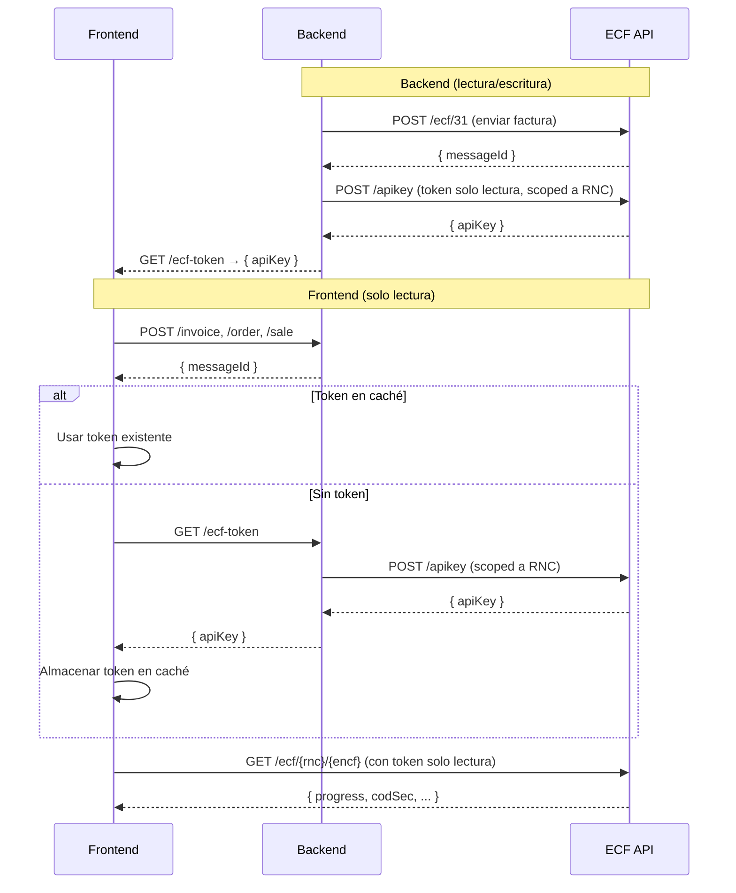

# EcfDgiiClient

SDK de Swift para la **API de ECF DGII** — procesamiento de comprobantes fiscales electrónicos (e-CF) de República Dominicana.

Certificado por la DGII. Compatible con iOS, macOS, tvOS y watchOS.

## Instalación

### Swift Package Manager (recomendado)

Agrega a tu `Package.swift`:

```swift
dependencies: [
    .package(url: "https://github.com/puntoos/ecf-dgii-swift.git", from: "0.1.0")
]
```

O en Xcode: **File > Add Package Dependencies** e ingresa la URL del repositorio.

### CocoaPods

```ruby
pod 'EcfDgiiClient', '~> 0.1.0'
```

## Inicio rápido

```swift
import EcfDgiiClient

// Inicializar el cliente
let client = EcfClient(
    apiKey: "tu-token-jwt-bearer",
    environment: .prod  // .test, .cert o .prod
)

// Enviar un ECF con enrutamiento automático y polling
let ecf = ECF(
    encabezado: Encabezado(
        version: .e10,
        idDoc: IdDoc(
            tipoeCF: .facturaDeCreditoFiscalElectronica,
            encf: "E310000000001"
        ),
        emisor: Emisor(
            rncEmisor: "123456789",
            razonSocialEmisor: "Mi Empresa SRL",
            direccionEmisor: "Santo Domingo"
        ),
        totales: totales
    ),
    detallesItems: items
)

do {
    let result = try await client.sendEcf(ecf: ecf)
    print("ECF aceptado: \(result.encf), estado: \(result.estatus)")
} catch let error as EcfProcessingError {
    print("ECF rechazado: \(error.message)")
    print("Respuesta DGII: \(error.response)")
}
```

## Características

### Cliente de alto nivel (`EcfClient`)

`EcfClient` proporciona una interfaz simplificada que maneja:

- **Enrutamiento automático** — determina el endpoint correcto (31-47) a partir de `encabezado.idDoc.tipoeCF`
- **Polling con backoff exponencial** — espera a que la DGII termine de procesar
- **Manejo de errores** — lanza `EcfProcessingError` con la respuesta completa de la DGII en caso de rechazo
- **Soporte de cancelación** — mediante concurrencia estructurada de Swift (`Task.cancel()`)

```swift
// Opciones de polling personalizadas
let options = PollingOptions(
    initialDelay: 2.0,      // segundos
    maxDelay: 60.0,          // máximo de segundos entre polls
    maxRetries: 30,
    backoffMultiplier: 1.5,
    timeout: 300             // timeout total en segundos
)

let result = try await client.sendEcf(ecf: ecf, pollingOptions: options)
```

### Arquitectura Backend / Frontend



### Flujo detallado

**Backend** (usa `EcfClient` con permisos de lectura/escritura):

1. Tu backend recibe la factura del usuario (ej. `POST /invoice`)
2. Valida, guarda y convierte la factura interna al formato ECF
3. Envía el ECF a la API usando el token principal → recibe `messageId`
4. Expone un endpoint `GET /ecf-token` que llama a `POST /apikey` de ECF SSD y retorna un **token de solo lectura** con alcance al RNC del tenant

**Frontend** (usa `EcfFrontendClient`):

1. El usuario invoca un endpoint del backend (`/invoice`, `/order`, `/sale`) → recibe el `messageId`
2. Verifica si hay un token en caché (memoria, localStorage, etc.)
   - **Si existe**: lo usa directamente
   - **Si no existe**: llama a `GET /ecf-token` del backend, almacena el token retornado en caché
3. Crea el cliente de solo lectura con el token
4. Consulta el estado del ECF directamente contra la API de ECF SSD

#### `EcfFrontendClient`

Para el frontend, usa `EcfFrontendClient` que expone únicamente los métodos de consulta (solo lectura):

```swift
import EcfDgiiClient

// Inicializar el cliente frontend con el token de solo lectura
let frontendClient = EcfFrontendClient(
    apiKey: "token-solo-lectura",
    environment: .prod  // .test, .cert o .prod
)

// Consultar el estado de un ECF
let ecfStatus = try await frontendClient.queryEcf(
    rnc: "123456789",
    encf: "E310000000001"
)

// Buscar ECFs con filtros
let results = try await frontendClient.searchEcfs(
    rnc: "123456789",
    tiposEcfs: [.facturaDeCreditoFiscalElectronica],
    fromFechaEmision: "2026-01-01",
    toFechaEmision: "2026-03-31",
    page: 1,
    limit: 20
)

// Buscar todos los ECFs (sin filtro por RNC)
let allEcfs = try await frontendClient.searchAllEcfs(
    tiposEcfs: [.facturaDeConsumoElectronica],
    page: 1,
    limit: 50
)

// Obtener un ECF por su ID de mensaje
let ecfById = try await frontendClient.getEcfById(
    rnc: "123456789",
    id: "message-uuid",
    includeEcfContent: true
)

// Consultar empresas
let companies = try await frontendClient.getCompanies(page: 1, limit: 10)
let company = try await frontendClient.getCompanyByRnc(rnc: "123456789")
```

**Métodos disponibles en `EcfFrontendClient`:**

| Método | Descripción |
|---|---|
| `queryEcf(rnc:encf:includeEcfContent:)` | Consultar el estado de un ECF específico |
| `searchEcfs(rnc:encfs:ids:tiposEcfs:includeEcfContent:fromFechaEmision:toFechaEmision:amountFrom:amountTo:page:limit:)` | Buscar ECFs con filtros |
| `searchAllEcfs(...)` | Buscar todos los ECFs sin filtro por RNC |
| `getEcfById(rnc:id:includeEcfContent:)` | Obtener un ECF por su ID de mensaje |
| `getCompanies(rncs:names:page:limit:)` | Listar empresas |
| `getCompanyByRnc(rnc:)` | Obtener una empresa por su RNC |

> **`sendEcf`** es una conveniencia que envuelve envío + polling. Para aplicaciones donde el frontend maneja la visualización del estado, usa `EcfFrontendClient` con los endpoints individuales de consulta.

### Acceso directo a la API

Todos los endpoints generados están disponibles mediante las clases estáticas de la API:

```swift
// Operaciones de empresa
let companies = try await CompanyAPI.getCompanies(apiConfiguration: client.apiConfiguration)
let company = try await CompanyAPI.getCompanyByRnc(rnc: "123456789", apiConfiguration: client.apiConfiguration)

// Consultas ECF
let ecfs = try await EcfAPI.searchEcfs(rnc: "123456789", apiConfiguration: client.apiConfiguration)
let status = try await EcfAPI.queryEcf(rnc: "123456789", encf: "E310000000001", apiConfiguration: client.apiConfiguration)

// Servicios DGII
let directorio = try await DgiiAPI.consultaDirectorioListado(rnc: "123456789", apiConfiguration: client.apiConfiguration)
let estado = try await DgiiAPI.consultaEstado(rnc: "123456789", rncEmisor: "...", ncfElectronico: "...", rncComprador: "...", codigoSeguridad: "...", apiConfiguration: client.apiConfiguration)

// Recepción
let requests = try await RecepcionAPI.searchEcfReceptionRequests(apiConfiguration: client.apiConfiguration)
```

### Entornos

| Entorno | URL base |
|---|---|
| `.test` | `https://api.test.ecfx.ssd.com.do` |
| `.cert` | `https://api.cert.ecfx.ssd.com.do` |
| `.prod` | `https://api.prod.ecfx.ssd.com.do` |

```swift
// O usa una URL base personalizada
let client = EcfClient(apiKey: "token", baseUrl: "https://url-personalizada.com")
```

## Tipos de ECF

| Tipo | Código | Descripción |
|---|---|---|
| `facturaDeCreditoFiscalElectronica` | 31 | Factura de Crédito Fiscal Electrónica |
| `facturaDeConsumoElectronica` | 32 | Factura de Consumo Electrónica |
| `notaDeDebitoElectronica` | 33 | Nota de Débito Electrónica |
| `notaDeCreditoElectronica` | 34 | Nota de Crédito Electrónica |
| `comprasElectronico` | 41 | Compras Electrónico |
| `gastosMenoresElectronico` | 43 | Gastos Menores Electrónico |
| `regimenesEspecialesElectronico` | 44 | Regímenes Especiales Electrónico |
| `gubernamentalElectronico` | 45 | Gubernamental Electrónico |
| `comprobanteDeExportacionesElectronico` | 46 | Comprobante de Exportaciones Electrónico |
| `comprobanteParaPagosAlExteriorElectronico` | 47 | Comprobante para Pagos al Exterior Electrónico |

## Endpoints de la API

### Operaciones de ECF
| Método | Endpoint | Descripción |
|---|---|---|
| POST | `/ecf/{31-47}` | Enviar ECF por tipo |
| GET | `/ecf/{rnc}/{encf}` | Consultar estado de ECF |
| GET | `/ecf/{rnc}` | Buscar ECFs |
| GET | `/ecf` | Buscar todos los ECFs |
| GET | `/ecf/{rnc}/message/{id}` | Obtener ECF por ID de mensaje |
| POST | `/ecf/aprobacioncomercial/{rnc}/{encf}` | Aprobación comercial |
| POST | `/ecf/anularrango/{rnc}` | Anulación de rango |
| GET | `/ecf/anulaciones` | Listar anulaciones |
| POST | `/ecf/FirmarSemilla/{rnc}` | Firmar semilla |

### Operaciones de empresa
| Método | Endpoint | Descripción |
|---|---|---|
| GET | `/company` | Listar empresas |
| GET | `/company/{rnc}` | Obtener empresa por RNC |
| PUT | `/company` | Crear/actualizar empresa |
| DELETE | `/company/{rnc}` | Eliminar empresa |
| GET | `/company/{rnc}/certificate` | Obtener certificado |
| PUT | `/company/{rnc}/certificate` | Actualizar certificado |

### Operaciones DGII
| Método | Endpoint | Descripción |
|---|---|---|
| GET | `/dgii/{rnc}/consultadirectorio/listado` | Listado de directorio |
| GET | `/dgii/{rnc}/consultaestado/estado` | Consulta de estado |
| GET | `/dgii/{rnc}/consultaresultado/estado` | Consulta de resultado |
| GET | `/dgii/{rnc}/consultatimbre` | Consulta de timbre |
| GET | `/dgii/{rnc}/estatusservicios/obtener-estatus` | Estado de servicios |

## Requisitos

- iOS 13.0+ / macOS 10.15+ / tvOS 13.0+ / watchOS 6.0+
- Swift 6.0+
- Xcode 16.0+

## Autenticación

La API usa autenticación con token JWT Bearer. Pasa tu API key al inicializar el cliente:

```swift
let client = EcfClient(apiKey: "tu-token-jwt", environment: .prod)
```

## Licencia

MIT
