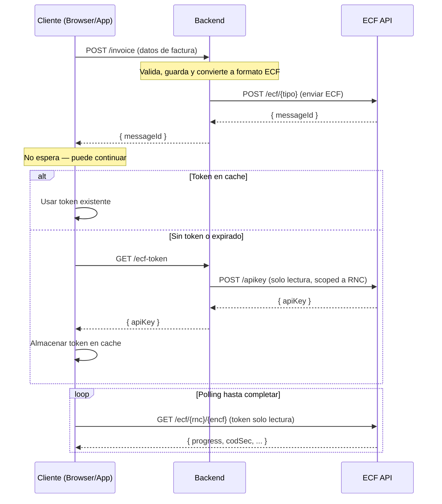

[](https://central.sonatype.com/artifact/do.com.ssd.ecfx/ecf-dgii-sdk-java)

# ECF DGII Java SDK

SDK de Java para la API de ECF DGII (comprobantes fiscales electrónicos de República Dominicana).

## Instalación

### Maven

```xml
<dependency>
    <groupId>do.com.ssd.ecfx</groupId>
    <artifactId>ecf-dgii-sdk-java</artifactId>
    <version>1.0.0</version>
</dependency>
```

### Gradle

```groovy
implementation 'do.com.ssd.ecfx:ecf-dgii-sdk-java:1.0.0'
```

## Inicio rápido

```java
import dom.com.ssd.ecfx.client.EcfClient;
import dom.com.ssd.ecfx.client.model.*;

// Crear cliente
EcfClient client = new EcfClient.Builder()
    .baseUrl("https://api.prod.ecfx.ssd.com.do")
    .apiKey("tu-token-jwt")
    .build();

// Enviar un ECF (enruta automáticamente, hace polling hasta completar)
ECF ecf = new ECF();
// ... construir tu documento ECF ...
EcfResponse response = client.sendEcf("tu-rnc", ecf);
System.out.println("Status: " + response.getEstatus());
```

## Ejemplo completo de ECF

```java
import dom.com.ssd.ecfx.client.EcfClient;
import dom.com.ssd.ecfx.client.model.*;

import java.text.SimpleDateFormat;
import java.util.Arrays;

EcfClient client = new EcfClient.Builder()
    .baseUrl("https://api.prod.ecfx.ssd.com.do")
    .apiKey("tu-token-jwt")
    .build();

SimpleDateFormat dateFormat = new SimpleDateFormat("yyyy-MM-dd");

// Construir una Factura de Crédito Fiscal Electrónica (tipo 31)
Ecf31ECF ecf = new Ecf31ECF();

// Encabezado
Ecf31Encabezado encabezado = new Ecf31Encabezado();

// IdDoc
Ecf31IdDoc idDoc = new Ecf31IdDoc();
idDoc.setEncf("E310000051630");
idDoc.setTipoeCF(TipoeCFType.FACTURA_DE_CREDITO_FISCAL_ELECTRONICA);
idDoc.setTipoPago(Ecf31TipoPagoType.CONTADO);
idDoc.setTipoIngresos(Ecf31TipoIngresosValidationType._01);
idDoc.setIndicadorMontoGravado(IndicadorMontoGravadoType.CON_ITBIS_INCLUIDO);
idDoc.setFechaVencimientoSecuencia(dateFormat.parse("2028-12-31"));

Ecf31FormaDePago formaPago = new Ecf31FormaDePago();
formaPago.setFormaPago(Ecf31FormaPagoType.EFECTIVO);
formaPago.setMontoPago(new Ecf31FormaDePagoMontoPago(1015.25));
idDoc.setTablaFormasPago(Arrays.asList(formaPago));

encabezado.setIdDoc(idDoc);

// Emisor
Ecf31Emisor emisor = new Ecf31Emisor();
emisor.setRncEmisor("131460941");
emisor.setFechaEmision(dateFormat.parse("2026-01-10"));
emisor.setDireccionEmisor("AVE. ISABEL AGUIAR NO. 269, ZONA INDUSTRIAL DE HERRERA");
emisor.setRazonSocialEmisor("DOCUMENTOS ELECTRONICOS DE 02");
encabezado.setEmisor(emisor);

// Comprador
Ecf31Comprador comprador = new Ecf31Comprador();
comprador.setRncComprador("131880681");
comprador.setRazonSocialComprador("DOCUMENTOS ELECTRONICOS DE 03");
encabezado.setComprador(comprador);

// Totales
Ecf31Totales totales = new Ecf31Totales();
totales.setItbiS1(new Ecf31IdDocTotalPaginas(18));
totales.setMontoGravadoI1(new Ecf31DescuentoORecargoMontoDescuentooRecargo(762.71));
totales.setMontoGravadoTotal(new Ecf31DescuentoORecargoMontoDescuentooRecargo(762.71));
totales.setTotalITBIS1(new Ecf31DescuentoORecargoMontoDescuentooRecargo(137.29));
totales.setTotalITBIS(new Ecf31DescuentoORecargoMontoDescuentooRecargo(137.29));
totales.setMontoNoFacturable(new Ecf31TotalesMontoNoFacturable(100.0));
totales.setMontoTotal(new Ecf31FormaDePagoMontoPago(1015.25));
totales.setMontoPeriodo(new Ecf31TotalesMontoNoFacturable(1015.25));

Ecf31ImpuestoAdicional2 impAdicional = new Ecf31ImpuestoAdicional2();
impAdicional.setTipoImpuesto(Ecf31CodificacionTipoImpuestosType._002);
impAdicional.setTasaImpuestoAdicional(new Ecf31ImpuestoAdicional2TasaImpuestoAdicional(2));
impAdicional.setOtrosImpuestosAdicionales(
    new Ecf31ImpuestoAdicional2MontoImpuestoSelectivoConsumoEspecifico(15.25));
totales.setImpuestosAdicionales(Arrays.asList(impAdicional));
totales.setMontoImpuestoAdicional(
    new Ecf31ImpuestoAdicional2MontoImpuestoSelectivoConsumoEspecifico(15.25));
encabezado.setTotales(totales);

encabezado.setVersion(Ecf31VersionType.VERSION1_0);
ecf.setEncabezado(encabezado);

// DetallesItems
Ecf31Item item1 = new Ecf31Item();
item1.setMontoItem(new Ecf31FormaDePagoMontoPago(1016.95));
item1.setNombreItem("Iphone 18 Pro max");
item1.setNumeroLinea(new AcecfReceptionRequestDtoProgress(1));
item1.setCantidadItem(new Ecf31ItemCantidadItem(1));
item1.setUnidadMedida(UnidadMedidaType.UNIDAD);
item1.setPrecioUnitarioItem(new Ecf31ItemPrecioUnitarioItem(1016.95));
item1.setIndicadorFacturacion(Ecf31IndicadorFacturacionType.ITBIS1_18_PERCENT);
item1.setIndicadorBienoServicio(Ecf31IndicadorBienoServicioType.BIEN);

Ecf31ImpuestoAdicional tablaImp = new Ecf31ImpuestoAdicional();
tablaImp.setTipoImpuesto(Ecf31CodificacionTipoImpuestosType._002);
item1.setTablaImpuestoAdicional(Arrays.asList(tablaImp));

Ecf31Item item2 = new Ecf31Item();
item2.setMontoItem(new Ecf31FormaDePagoMontoPago(100.0));
item2.setNombreItem("Costo de Envío");
item2.setNumeroLinea(new AcecfReceptionRequestDtoProgress(2));
item2.setCantidadItem(new Ecf31ItemCantidadItem(1));
item2.setUnidadMedida(UnidadMedidaType.UNIDAD);
item2.setPrecioUnitarioItem(new Ecf31ItemPrecioUnitarioItem(100.0));
item2.setIndicadorFacturacion(Ecf31IndicadorFacturacionType.NO_FACTURABLE_18_PERCENT);
item2.setIndicadorBienoServicio(Ecf31IndicadorBienoServicioType.SERVICIO);

ecf.setDetallesItems(Arrays.asList(item1, item2));

// DescuentosORecargos
Ecf31DescuentoORecargo descuento = new Ecf31DescuentoORecargo();
descuento.setTipoValor(TipoDescuentoRecargoType.DOLLAR);
descuento.setTipoAjuste(Ecf31TipoAjusteType.D);
descuento.setNumeroLinea(new AcecfReceptionRequestDtoProgress(1));
descuento.setMontoDescuentooRecargo(new Ecf31DescuentoORecargoMontoDescuentooRecargo(84.75));
descuento.setDescripcionDescuentooRecargo("Descuento");
descuento.setIndicadorFacturacionDescuentooRecargo(IndicadorFacturacionDRType.ITBIS1_18_PERCENT);

ecf.setDescuentosORecargos(Arrays.asList(descuento));

// Enviar
EcfResponse response = client.sendEcf("131460941", ecf);
System.out.println("Status: " + response.getEstatus());
```

## Autenticación

La API usa autenticación con token JWT Bearer. Configura tu token mediante:

1. **Builder**: `.apiKey("tu-token")`
2. **Variable de entorno**: `ECF_DGII_API_KEY`

## API de alto nivel: sendEcf

`sendEcf(rnc, ecf)` encapsula el flujo completo de envío de un ECF:

1. Enruta el ECF al endpoint correcto según el `tipoeCF`
2. Envía el documento
3. Hace polling hasta completar con backoff exponencial
4. Devuelve el `EcfResponse` final cuando termina

### Configuración de polling

```java
EcfClient client = new EcfClient.Builder()
    .baseUrl("https://api.prod.ecfx.ssd.com.do")
    .apiKey("tu-token")
    .pollingMaxDurationMs(120_000)  // 2 minutos (por defecto)
    .pollingIntervalMs(1_000)       // 1 segundo inicial (por defecto)
    .build();
```

## Arquitectura Backend / Frontend



### Flujo detallado

1. El **cliente** (browser/app) envía los datos de la factura al **backend** (`POST /invoice`, `/order`, `/sale`)
2. El **backend** valida, guarda y convierte la factura interna al formato ECF
3. El **backend** envía el ECF a la API de ECF SSD (`POST /ecf/{tipo}`) y recibe un `messageId`
4. El **backend** retorna el `messageId` al cliente — **el cliente no espera**, puede continuar
5. Cuando el cliente necesita consultar el estado del ECF, usa `EcfFrontendClient` que internamente:
   - Verifica si hay un **token de solo lectura** en cache
   - Si **no existe o expiró**: llama a `getToken()` (que el consumidor provee — típicamente un `fetch('/ecf-token')` a su backend), luego llama a `cacheToken(token)` para almacenarlo
   - Si la API retorna **401**: automáticamente llama a `getToken()` de nuevo, actualiza el cache, y reintenta
6. El cliente hace **polling** directamente contra la API de ECF SSD (`GET /ecf/{rnc}/{encf}`) hasta que `progress` sea `Finished`

### Ejemplo: Frontend (con `EcfFrontendClient`)

```java
// 1. Enviar la factura al backend
Response invoiceRes = httpClient.newCall(new Request.Builder()
    .url("https://my-backend/api/v1/invoices")
    .post(RequestBody.create(invoiceJson, JSON)).build()).execute();
JSONObject result = new JSONObject(invoiceRes.body().string());
String rnc = result.getString("rnc");
String encf = result.getString("encf");
// El cliente no espera — puede continuar con otras operaciones

// 2. Crear cliente de solo lectura (getToken se llama automáticamente)
EcfFrontendClient frontend = new EcfFrontendClient.Builder()
    .getToken(() -> {
        Response res = httpClient.newCall(new Request.Builder()
            .url("https://my-backend/api/v1/ecf-token").build()).execute();
        return new JSONObject(res.body().string()).getString("apiKey");
    })
    .environment("prod")
    // cacheToken usa archivo encriptado en disco por defecto
    .build();

// 3. Consultar el estado del ECF
frontend.queryEcf(rnc, encf);
frontend.searchEcfs(rnc);
```

## Acceso directo a la API

Todas las clases de API generadas están disponibles para uso directo:

```java
// Gestión de empresas
client.getCompanyApi().getCompanies(null, null, 1, 25);
client.getCompanyApi().getCompanyByRnc("123456789");

// Operaciones ECF
client.getEcfApi().searchEcfs("123456789", null, null, null, false, null, null, null, null, 1, 25);

// Consultas DGII
client.getDgiiApi().consultaEstado("rnc", "encf");

// Recepción
client.getRecepcionApi().searchEcfReceptionRequests(null, null, null, 1, 25);
```

## Tipos de ECF soportados

| Tipo | Código | Endpoint |
|------|--------|----------|
| Factura de Credito Fiscal Electronica | 31 | `/ecf/31` |
| Factura de Consumo Electronica | 32 | `/ecf/32` |
| Nota de Debito Electronica | 33 | `/ecf/33` |
| Nota de Credito Electronica | 34 | `/ecf/34` |
| Compras Electronico | 41 | `/ecf/41` |
| Gastos Menores Electronico | 43 | `/ecf/43` |
| Regimenes Especiales Electronico | 44 | `/ecf/44` |
| Gubernamental Electronico | 45 | `/ecf/45` |
| Comprobante de Exportaciones Electronico | 46 | `/ecf/46` |
| Comprobante para Pagos al Exterior Electronico | 47 | `/ecf/47` |

## Compatibilidad con Android

Este SDK es compatible con Android API 21+ (Android 5.0). Utiliza:
- OkHttp (soporte HTTP nativo de Android)
- ThreeTenBP (backport de date/time de Java 8 para Android)

## Compilar desde el código fuente

```bash
./mvnw clean install
```

## Entornos

| Entorno | URL |
|---------|-----|
| Test | `https://api.test.ecfx.ssd.com.do` |
| Certificación | `https://api.cert.ecfx.ssd.com.do` |
| Producción | `https://api.prod.ecfx.ssd.com.do` |
