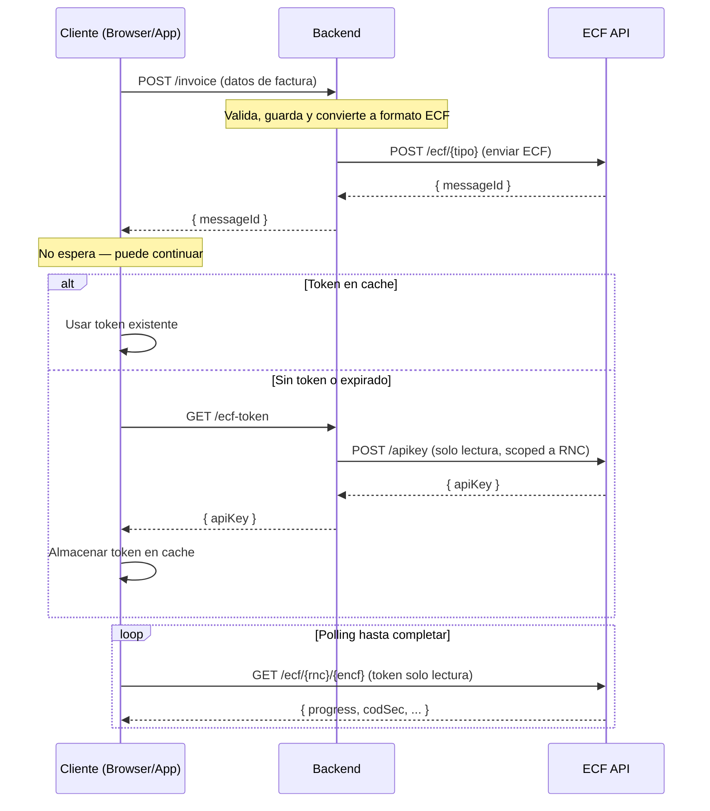

[](https://central.sonatype.com/artifact/do.com.ssd.ecfx/ecf-dgii-sdk-kotlin)

**Paquete:** [do.com.ssd.ecfx:ecf-dgii-sdk-kotlin en Maven Central](https://central.sonatype.com/artifact/do.com.ssd.ecfx/ecf-dgii-sdk-kotlin)

# ECF DGII Kotlin SDK

SDK de Kotlin para la API de ECF DGII (comprobantes fiscales electrónicos de República Dominicana).

## Descripción general

Este cliente de API fue generado por el proyecto [OpenAPI Generator](https://openapi-generator.tech). Usando la [openapi-spec](https://github.com/OAI/OpenAPI-Specification) de un servidor remoto, puedes generar fácilmente un cliente de API.

- Versión de API: v1
- Versión del paquete:
- Versión del generador: 7.20.0
- Paquete de compilación: org.openapitools.codegen.languages.KotlinClientCodegen

## Requisitos

* Kotlin 2.2.20
* Gradle 8.14

## Compilación

Primero, crea el script wrapper de Gradle:

```
gradle wrapper
```

Luego, ejecuta:

```
./gradlew check assemble
```

Esto ejecuta todas las pruebas y empaqueta la biblioteca.

## Instalación

### Gradle (Kotlin DSL)

```kotlin
implementation("do.com.ssd.ecfx:ecf-dgii-sdk-kotlin:1.0.0")
```

### Gradle (Groovy)

```groovy
implementation 'do.com.ssd.ecfx:ecf-dgii-sdk-kotlin:1.0.0'
```

### Maven

```xml
<dependency>
    <groupId>do.com.ssd.ecfx</groupId>
    <artifactId>ecf-dgii-sdk-kotlin</artifactId>
    <version>1.0.0</version>
</dependency>
```

## Características / Notas de implementación

* Soporta entradas/salidas JSON, entradas de archivos y entradas de formularios.
* Soporta formatos de colección para parámetros de consulta: csv, tsv, ssv, pipes.
* Algunos tipos de Kotlin y Java están completamente cualificados para evitar conflictos con tipos definidos en las definiciones de OpenAPI.
* La implementación de ApiClient está diseñada para reducir el conteo de métodos, específicamente para beneficiar los targets de Android.

## Arquitectura Backend / Frontend



### Flujo detallado

1. El **cliente** (browser/app) envía los datos de la factura al **backend** (`POST /invoice`, `/order`, `/sale`)
2. El **backend** valida, guarda y convierte la factura interna al formato ECF
3. El **backend** envía el ECF a la API de ECF SSD (`POST /ecf/{tipo}`) y recibe un `messageId`
4. El **backend** retorna el `messageId` al cliente — **el cliente no espera**, puede continuar
5. Cuando el cliente necesita consultar el estado del ECF, usa `EcfFrontendClient` que internamente:
   - Verifica si hay un **token de solo lectura** en cache
   - Si **no existe o expiró**: llama a `getToken()` (que el consumidor provee — típicamente un `fetch('/ecf-token')` a su backend), luego llama a `cacheToken(token)` para almacenarlo
   - Si la API retorna **401**: automáticamente llama a `getToken()` de nuevo, actualiza el cache, y reintenta
6. El cliente hace **polling** directamente contra la API de ECF SSD (`GET /ecf/{rnc}/{encf}`) hasta que `progress` sea `Finished`

### Ejemplo: Frontend (con `EcfFrontendClient`)

```kotlin
// 1. Enviar la factura al backend
val invoiceRes = httpClient.post("https://my-backend/api/v1/invoices") {
    setBody(invoiceData)
}
val result = invoiceRes.body<InvoiceResult>()
// El cliente no espera — puede continuar con otras operaciones

// 2. Crear cliente de solo lectura (getToken se llama automáticamente)
val frontend = EcfFrontendClient(EcfFrontendClientConfig(
    getToken = {
        val res = httpClient.get("https://my-backend/api/v1/ecf-token")
        res.body<TokenResponse>().apiKey
    },
    environment = "prod"
    // cacheToken usa archivo encriptado en disco por defecto
))

// 3. Consultar el estado del ECF
val ecf = frontend.queryEcf(result.rnc, result.encf)
val ecfs = frontend.searchEcfs(result.rnc)
```

## Entornos

| Entorno | URL |
|---------|-----|
| `test` | `https://api.test.ecfx.ssd.com.do` |
| `cert` | `https://api.cert.ecfx.ssd.com.do` |
| `prod` | `https://api.prod.ecfx.ssd.com.do` |

<a id="documentation-for-api-endpoints"></a>
## Documentación de endpoints de la API

Todas las URIs son relativas a *https://api.test.ecfx.ssd.com.do*

| Clase | Método | Petición HTTP | Descripción |
| ------------ | ------------- | ------------- | ------------- |
| *ApiKeyApi* | [**newCompanyApiKey**](docs/ApiKeyApi.md#newcompanyapikey) | **POST** /apiKey |  |
| *CompanyApi* | [**deleteCompany**](docs/CompanyApi.md#deletecompany) | **DELETE** /company/{rnc} |  |
| *CompanyApi* | [**getCompanies**](docs/CompanyApi.md#getcompanies) | **GET** /company |  |
| *CompanyApi* | [**getCompanyByRnc**](docs/CompanyApi.md#getcompanybyrnc) | **GET** /company/{rnc} |  |
| *CompanyApi* | [**getCurrentCertificate**](docs/CompanyApi.md#getcurrentcertificate) | **GET** /company/{rnc}/certificate |  |
| *CompanyApi* | [**updateCertificateCompany**](docs/CompanyApi.md#updatecertificatecompany) | **PUT** /company/{rnc}/certificate |  |
| *CompanyApi* | [**upsertCompany**](docs/CompanyApi.md#upsertcompany) | **PUT** /company |  |
| *DgiiApi* | [**consultaDirectorioListado**](docs/DgiiApi.md#consultadirectoriolistado) | **GET** /dgii/{rnc}/consultadirectorio/listado |  |
| *DgiiApi* | [**consultaDirectorioObtenerDirectorioPorRnc**](docs/DgiiApi.md#consultadirectorioobtenerdirectorioporrnc) | **GET** /dgii/{rnc}/consultadirectorio/obtener-directorio-por-rnc |  |
| *DgiiApi* | [**consultaEstado**](docs/DgiiApi.md#consultaestado) | **GET** /dgii/{rnc}/consultaestado/estado |  |
| *DgiiApi* | [**consultaRFCE**](docs/DgiiApi.md#consultarfce) | **GET** /dgii/{rnc}/consultarfce/consulta |  |
| *DgiiApi* | [**consultaResultado**](docs/DgiiApi.md#consultaresultado) | **GET** /dgii/{rnc}/consultaresultado/estado |  |
| *DgiiApi* | [**consultaTimbre**](docs/DgiiApi.md#consultatimbre) | **GET** /dgii/{rnc}/consultatimbre |  |
| *DgiiApi* | [**consultaTimbreFC**](docs/DgiiApi.md#consultatimbrefc) | **GET** /dgii/{rnc}/consultatimbrefc |  |
| *DgiiApi* | [**consultaTrackId**](docs/DgiiApi.md#consultatrackid) | **GET** /dgii/{rnc}/consultatrackids/consulta |  |
| *DgiiApi* | [**estatusServiciosObtenerEstatus**](docs/DgiiApi.md#estatusserviciosobtenerestatus) | **GET** /dgii/{rnc}/estatusservicios/obtener-estatus |  |
| *DgiiApi* | [**estatusServiciosObtenerVentanasMantenimiento**](docs/DgiiApi.md#estatusserviciosobtenerventanasmantenimiento) | **GET** /dgii/{rnc}/estatusservicios/obtener-ventanas-mantenimiento |  |
| *EcfApi* | [**anulacionRangos**](docs/EcfApi.md#anulacionrangos) | **POST** /ecf/anularrango/{rnc} |  |
| *EcfApi* | [**aprobacionComercial**](docs/EcfApi.md#aprobacioncomercial) | **POST** /ecf/aprobacioncomercial/{rnc}/{encf} |  |
| *EcfApi* | [**firmarSemilla**](docs/EcfApi.md#firmarsemilla) | **POST** /ecf/FirmarSemilla/{rnc} |  |
| *EcfApi* | [**getEcfById**](docs/EcfApi.md#getecfbyid) | **GET** /ecf/{rnc}/message/{id} |  |
| *EcfApi* | [**listAnulaciones**](docs/EcfApi.md#listanulaciones) | **GET** /ecf/anulaciones |  |
| *EcfApi* | [**queryEcf**](docs/EcfApi.md#queryecf) | **GET** /ecf/{rnc}/{encf} |  |
| *EcfApi* | [**recepcionEcf31**](docs/EcfApi.md#recepcionecf31) | **POST** /ecf/31 |  |
| *EcfApi* | [**recepcionEcf32**](docs/EcfApi.md#recepcionecf32) | **POST** /ecf/32 |  |
| *EcfApi* | [**recepcionEcf33**](docs/EcfApi.md#recepcionecf33) | **POST** /ecf/33 |  |
| *EcfApi* | [**recepcionEcf34**](docs/EcfApi.md#recepcionecf34) | **POST** /ecf/34 |  |
| *EcfApi* | [**recepcionEcf41**](docs/EcfApi.md#recepcionecf41) | **POST** /ecf/41 |  |
| *EcfApi* | [**recepcionEcf43**](docs/EcfApi.md#recepcionecf43) | **POST** /ecf/43 |  |
| *EcfApi* | [**recepcionEcf44**](docs/EcfApi.md#recepcionecf44) | **POST** /ecf/44 |  |
| *EcfApi* | [**recepcionEcf45**](docs/EcfApi.md#recepcionecf45) | **POST** /ecf/45 |  |
| *EcfApi* | [**recepcionEcf46**](docs/EcfApi.md#recepcionecf46) | **POST** /ecf/46 |  |
| *EcfApi* | [**recepcionEcf47**](docs/EcfApi.md#recepcionecf47) | **POST** /ecf/47 |  |
| *EcfApi* | [**searchAllEcfs**](docs/EcfApi.md#searchallecfs) | **GET** /ecf |  |
| *EcfApi* | [**searchEcfs**](docs/EcfApi.md#searchecfs) | **GET** /ecf/{rnc} |  |
| *RecepcionApi* | [**getAcecfReceptionRequest**](docs/RecepcionApi.md#getacecfreceptionrequest) | **GET** /recepcion/{rnc}/acecf/{messageId} |  |
| *RecepcionApi* | [**getEcfReceptionRequest**](docs/RecepcionApi.md#getecfreceptionrequest) | **GET** /recepcion/{rnc}/ecf/{messageId} |  |
| *RecepcionApi* | [**searchAcecfReceptionRequests**](docs/RecepcionApi.md#searchacecfreceptionrequests) | **GET** /recepcion/acecf |  |
| *RecepcionApi* | [**searchAcecfReceptionRequestsByRnc**](docs/RecepcionApi.md#searchacecfreceptionrequestsbyrnc) | **GET** /recepcion/{rnc}/acecf |  |
| *RecepcionApi* | [**searchEcfReceptionRequests**](docs/RecepcionApi.md#searchecfreceptionrequests) | **GET** /recepcion/ecf |  |
| *RecepcionApi* | [**searchEcfReceptionRequestsByRnc**](docs/RecepcionApi.md#searchecfreceptionrequestsbyrnc) | **GET** /recepcion/{rnc}/ecf |  |


<a id="documentation-for-models"></a>
## Documentación de modelos

 - [dom.com.ssd.ecfx.sdk.models.AcecfReceptionRequestDto](docs/AcecfReceptionRequestDto.md)
 - [dom.com.ssd.ecfx.sdk.models.AcecfReceptionRequestDtoProgress](docs/AcecfReceptionRequestDtoProgress.md)
 - [dom.com.ssd.ecfx.sdk.models.AllTipoECFTypes](docs/AllTipoECFTypes.md)
 - [dom.com.ssd.ecfx.sdk.models.AnulacionListResponse](docs/AnulacionListResponse.md)
 - [dom.com.ssd.ecfx.sdk.models.AnulacionRequest](docs/AnulacionRequest.md)
 - [dom.com.ssd.ecfx.sdk.models.CertificateResponse](docs/CertificateResponse.md)
 - [dom.com.ssd.ecfx.sdk.models.CodificacionTipoImpuestosType](docs/CodificacionTipoImpuestosType.md)
 - [dom.com.ssd.ecfx.sdk.models.CodigoModificacionType](docs/CodigoModificacionType.md)
 - [dom.com.ssd.ecfx.sdk.models.CodigosItem](docs/CodigosItem.md)
 - [dom.com.ssd.ecfx.sdk.models.CompanyResponse](docs/CompanyResponse.md)
 - [dom.com.ssd.ecfx.sdk.models.Comprador](docs/Comprador.md)
 - [dom.com.ssd.ecfx.sdk.models.DGIIEnvironment](docs/DGIIEnvironment.md)
 - [dom.com.ssd.ecfx.sdk.models.DescuentoORecargo](docs/DescuentoORecargo.md)
 - [dom.com.ssd.ecfx.sdk.models.DescuentoORecargoMontoDescuentooRecargo](docs/DescuentoORecargoMontoDescuentooRecargo.md)
 - [dom.com.ssd.ecfx.sdk.models.DescuentoORecargoValorDescuentooRecargo](docs/DescuentoORecargoValorDescuentooRecargo.md)
 - [dom.com.ssd.ecfx.sdk.models.DetalleAnulacionRequest](docs/DetalleAnulacionRequest.md)
 - [dom.com.ssd.ecfx.sdk.models.DetalleAnulacionRequestDto](docs/DetalleAnulacionRequestDto.md)
 - [dom.com.ssd.ecfx.sdk.models.Directorio](docs/Directorio.md)
 - [dom.com.ssd.ecfx.sdk.models.ECF](docs/ECF.md)
 - [dom.com.ssd.ecfx.sdk.models.ECFType](docs/ECFType.md)
 - [dom.com.ssd.ecfx.sdk.models.EcfEstado](docs/EcfEstado.md)
 - [dom.com.ssd.ecfx.sdk.models.EcfProgress](docs/EcfProgress.md)
 - [dom.com.ssd.ecfx.sdk.models.EcfReceptionRequestDto](docs/EcfReceptionRequestDto.md)
 - [dom.com.ssd.ecfx.sdk.models.EcfResponse](docs/EcfResponse.md)
 - [dom.com.ssd.ecfx.sdk.models.Emisor](docs/Emisor.md)
 - [dom.com.ssd.ecfx.sdk.models.Encabezado](docs/Encabezado.md)
 - [dom.com.ssd.ecfx.sdk.models.EstadoType](docs/EstadoType.md)
 - [dom.com.ssd.ecfx.sdk.models.FormaDePago](docs/FormaDePago.md)
 - [dom.com.ssd.ecfx.sdk.models.FormaDePagoMontoPago](docs/FormaDePagoMontoPago.md)
 - [dom.com.ssd.ecfx.sdk.models.FormaPagoType](docs/FormaPagoType.md)
 - [dom.com.ssd.ecfx.sdk.models.GetCompaniesLimitParameter](docs/GetCompaniesLimitParameter.md)
 - [dom.com.ssd.ecfx.sdk.models.GetCompaniesPageParameter](docs/GetCompaniesPageParameter.md)
 - [dom.com.ssd.ecfx.sdk.models.IdDoc](docs/IdDoc.md)
 - [dom.com.ssd.ecfx.sdk.models.IdDocTotalPaginas](docs/IdDocTotalPaginas.md)
 - [dom.com.ssd.ecfx.sdk.models.ImpuestoAdicional](docs/ImpuestoAdicional.md)
 - [dom.com.ssd.ecfx.sdk.models.ImpuestoAdicional2](docs/ImpuestoAdicional2.md)
 - [dom.com.ssd.ecfx.sdk.models.ImpuestoAdicional2MontoImpuestoSelectivoConsumoEspecifico](docs/ImpuestoAdicional2MontoImpuestoSelectivoConsumoEspecifico.md)
 - [dom.com.ssd.ecfx.sdk.models.ImpuestoAdicional2TasaImpuestoAdicional](docs/ImpuestoAdicional2TasaImpuestoAdicional.md)
 - [dom.com.ssd.ecfx.sdk.models.ImpuestoAdicionalOtraMoneda](docs/ImpuestoAdicionalOtraMoneda.md)
 - [dom.com.ssd.ecfx.sdk.models.IndicadorAgenteRetencionoPercepcionType](docs/IndicadorAgenteRetencionoPercepcionType.md)
 - [dom.com.ssd.ecfx.sdk.models.IndicadorBienoServicioType](docs/IndicadorBienoServicioType.md)
 - [dom.com.ssd.ecfx.sdk.models.IndicadorEnvioDiferidoType](docs/IndicadorEnvioDiferidoType.md)
 - [dom.com.ssd.ecfx.sdk.models.IndicadorFacturacionDRType](docs/IndicadorFacturacionDRType.md)
 - [dom.com.ssd.ecfx.sdk.models.IndicadorFacturacionType](docs/IndicadorFacturacionType.md)
 - [dom.com.ssd.ecfx.sdk.models.IndicadorMontoGravadoType](docs/IndicadorMontoGravadoType.md)
 - [dom.com.ssd.ecfx.sdk.models.IndicadorNorma1007Type](docs/IndicadorNorma1007Type.md)
 - [dom.com.ssd.ecfx.sdk.models.IndicadorServicioTodoIncluidoType](docs/IndicadorServicioTodoIncluidoType.md)
 - [dom.com.ssd.ecfx.sdk.models.InformacionReferencia](docs/InformacionReferencia.md)
 - [dom.com.ssd.ecfx.sdk.models.InformacionesAdicionales](docs/InformacionesAdicionales.md)
 - [dom.com.ssd.ecfx.sdk.models.Item](docs/Item.md)
 - [dom.com.ssd.ecfx.sdk.models.ItemCantidadItem](docs/ItemCantidadItem.md)
 - [dom.com.ssd.ecfx.sdk.models.ItemPrecioUnitarioItem](docs/ItemPrecioUnitarioItem.md)
 - [dom.com.ssd.ecfx.sdk.models.LiquidacionType](docs/LiquidacionType.md)
 - [dom.com.ssd.ecfx.sdk.models.Mensaje](docs/Mensaje.md)
 - [dom.com.ssd.ecfx.sdk.models.MensajeCodigo](docs/MensajeCodigo.md)
 - [dom.com.ssd.ecfx.sdk.models.Mineria](docs/Mineria.md)
 - [dom.com.ssd.ecfx.sdk.models.MineriaPesoNetoKilogramo](docs/MineriaPesoNetoKilogramo.md)
 - [dom.com.ssd.ecfx.sdk.models.NewCompanyApiKey](docs/NewCompanyApiKey.md)
 - [dom.com.ssd.ecfx.sdk.models.OtraMoneda](docs/OtraMoneda.md)
 - [dom.com.ssd.ecfx.sdk.models.OtraMonedaDetalle](docs/OtraMonedaDetalle.md)
 - [dom.com.ssd.ecfx.sdk.models.OtraMonedaTipoCambio](docs/OtraMonedaTipoCambio.md)
 - [dom.com.ssd.ecfx.sdk.models.Pagina](docs/Pagina.md)
 - [dom.com.ssd.ecfx.sdk.models.PaginatedApiResultOfAcecfReceptionRequestDto](docs/PaginatedApiResultOfAcecfReceptionRequestDto.md)
 - [dom.com.ssd.ecfx.sdk.models.PaginatedApiResultOfAnulacionListResponse](docs/PaginatedApiResultOfAnulacionListResponse.md)
 - [dom.com.ssd.ecfx.sdk.models.PaginatedApiResultOfCompanyResponse](docs/PaginatedApiResultOfCompanyResponse.md)
 - [dom.com.ssd.ecfx.sdk.models.PaginatedApiResultOfEcfReceptionRequestDto](docs/PaginatedApiResultOfEcfReceptionRequestDto.md)
 - [dom.com.ssd.ecfx.sdk.models.PaginatedApiResultOfEcfResponse](docs/PaginatedApiResultOfEcfResponse.md)
 - [dom.com.ssd.ecfx.sdk.models.ProblemDetails](docs/ProblemDetails.md)
 - [dom.com.ssd.ecfx.sdk.models.ProvinciaMunicipioType](docs/ProvinciaMunicipioType.md)
 - [dom.com.ssd.ecfx.sdk.models.RespuestaAnulacionRango](docs/RespuestaAnulacionRango.md)
 - [dom.com.ssd.ecfx.sdk.models.RespuestaConsultaEstado](docs/RespuestaConsultaEstado.md)
 - [dom.com.ssd.ecfx.sdk.models.RespuestaConsultaEstadoCodigo](docs/RespuestaConsultaEstadoCodigo.md)
 - [dom.com.ssd.ecfx.sdk.models.RespuestaConsultaEstadoMontoTotal](docs/RespuestaConsultaEstadoMontoTotal.md)
 - [dom.com.ssd.ecfx.sdk.models.RespuestaConsultaEstadoTotalITBIS](docs/RespuestaConsultaEstadoTotalITBIS.md)
 - [dom.com.ssd.ecfx.sdk.models.RespuestaConsultaRFCE](docs/RespuestaConsultaRFCE.md)
 - [dom.com.ssd.ecfx.sdk.models.RespuestaConsultaTimbre](docs/RespuestaConsultaTimbre.md)
 - [dom.com.ssd.ecfx.sdk.models.RespuestaConsultaTrackId](docs/RespuestaConsultaTrackId.md)
 - [dom.com.ssd.ecfx.sdk.models.RespuestaEstatusServicio](docs/RespuestaEstatusServicio.md)
 - [dom.com.ssd.ecfx.sdk.models.RespuestaVentanaDeMantenimiento](docs/RespuestaVentanaDeMantenimiento.md)
 - [dom.com.ssd.ecfx.sdk.models.Retencion](docs/Retencion.md)
 - [dom.com.ssd.ecfx.sdk.models.SearchEcfsAmountFromParameter](docs/SearchEcfsAmountFromParameter.md)
 - [dom.com.ssd.ecfx.sdk.models.SecuenciaRequest](docs/SecuenciaRequest.md)
 - [dom.com.ssd.ecfx.sdk.models.SecuenciaRequestDto](docs/SecuenciaRequestDto.md)
 - [dom.com.ssd.ecfx.sdk.models.SendAcecfRequest](docs/SendAcecfRequest.md)
 - [dom.com.ssd.ecfx.sdk.models.SubDescuento](docs/SubDescuento.md)
 - [dom.com.ssd.ecfx.sdk.models.SubRecargo](docs/SubRecargo.md)
 - [dom.com.ssd.ecfx.sdk.models.SubcantidadItem](docs/SubcantidadItem.md)
 - [dom.com.ssd.ecfx.sdk.models.Subtotal](docs/Subtotal.md)
 - [dom.com.ssd.ecfx.sdk.models.SubtotalImpuestoAdicional](docs/SubtotalImpuestoAdicional.md)
 - [dom.com.ssd.ecfx.sdk.models.TipoAfiliacionType](docs/TipoAfiliacionType.md)
 - [dom.com.ssd.ecfx.sdk.models.TipoAjusteType](docs/TipoAjusteType.md)
 - [dom.com.ssd.ecfx.sdk.models.TipoCuentaPagoType](docs/TipoCuentaPagoType.md)
 - [dom.com.ssd.ecfx.sdk.models.TipoDescuentoRecargoType](docs/TipoDescuentoRecargoType.md)
 - [dom.com.ssd.ecfx.sdk.models.TipoIngresosValidationType](docs/TipoIngresosValidationType.md)
 - [dom.com.ssd.ecfx.sdk.models.TipoMonedaType](docs/TipoMonedaType.md)
 - [dom.com.ssd.ecfx.sdk.models.TipoPagoType](docs/TipoPagoType.md)
 - [dom.com.ssd.ecfx.sdk.models.TipoeCFType](docs/TipoeCFType.md)
 - [dom.com.ssd.ecfx.sdk.models.Token](docs/Token.md)
 - [dom.com.ssd.ecfx.sdk.models.Totales](docs/Totales.md)
 - [dom.com.ssd.ecfx.sdk.models.TotalesMontoPeriodo](docs/TotalesMontoPeriodo.md)
 - [dom.com.ssd.ecfx.sdk.models.Transporte](docs/Transporte.md)
 - [dom.com.ssd.ecfx.sdk.models.UnidadMedidaType](docs/UnidadMedidaType.md)
 - [dom.com.ssd.ecfx.sdk.models.UpsertCompanyRequest](docs/UpsertCompanyRequest.md)
 - [dom.com.ssd.ecfx.sdk.models.VentanaDeMantenimiento](docs/VentanaDeMantenimiento.md)
 - [dom.com.ssd.ecfx.sdk.models.VersionType](docs/VersionType.md)
 - [dom.com.ssd.ecfx.sdk.models.ViaTransporteType](docs/ViaTransporteType.md)


<a id="documentation-for-authorization"></a>
## Documentación de autorización


Esquemas de autenticación definidos para la API:
<a id="Bearer"></a>
### Bearer

- **Tipo**: Autenticación HTTP con token Bearer (JWT)
