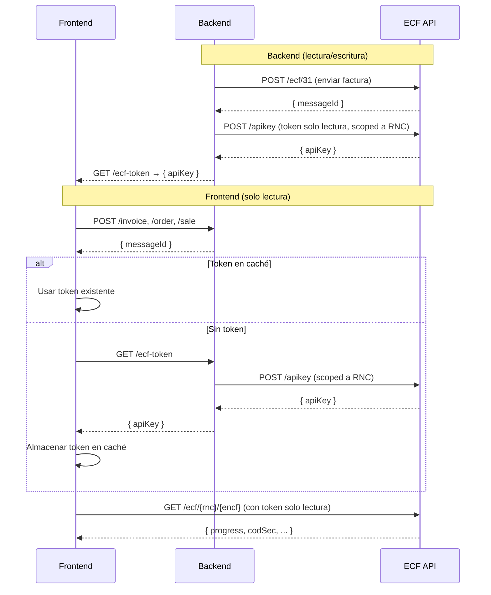

# com.ecfx.sdk - Biblioteca cliente Kotlin para la API de ECF

SDK de Kotlin para la API de ECF DGII (comprobantes fiscales electrónicos de República Dominicana).

## Descripción general

Este cliente de API fue generado por el proyecto [OpenAPI Generator](https://openapi-generator.tech). Usando la [openapi-spec](https://github.com/OAI/OpenAPI-Specification) de un servidor remoto, puedes generar fácilmente un cliente de API.

- Versión de API: v1
- Versión del paquete:
- Versión del generador: 7.20.0
- Paquete de compilación: org.openapitools.codegen.languages.KotlinClientCodegen

## Requisitos

* Kotlin 2.2.20
* Gradle 8.14

## Compilación

Primero, crea el script wrapper de Gradle:

```
gradle wrapper
```

Luego, ejecuta:

```
./gradlew check assemble
```

Esto ejecuta todas las pruebas y empaqueta la biblioteca.

## Características / Notas de implementación

* Soporta entradas/salidas JSON, entradas de archivos y entradas de formularios.
* Soporta formatos de colección para parámetros de consulta: csv, tsv, ssv, pipes.
* Algunos tipos de Kotlin y Java están completamente cualificados para evitar conflictos con tipos definidos en las definiciones de OpenAPI.
* La implementación de ApiClient está diseñada para reducir el conteo de métodos, específicamente para beneficiar los targets de Android.

## Arquitectura Backend / Frontend



### Flujo detallado

**Backend** (usa `EcfClient` con permisos de lectura/escritura):

1. Tu backend recibe la factura del usuario (ej. `POST /invoice`)
2. Valida, guarda y convierte la factura interna al formato ECF
3. Envía el ECF a la API usando el token principal → recibe `messageId`
4. Expone un endpoint `GET /ecf-token` que llama a `POST /apikey` de ECF SSD y retorna un **token de solo lectura** con alcance al RNC del tenant

**Frontend** (usa `EcfFrontendClient`):

1. El usuario invoca un endpoint del backend (`/invoice`, `/order`, `/sale`) → recibe el `messageId`
2. Verifica si hay un token en caché (memoria, localStorage, etc.)
   - **Si existe**: lo usa directamente
   - **Si no existe**: llama a `GET /ecf-token` del backend, almacena el token retornado en caché
3. Crea el cliente de solo lectura con el token
4. Consulta el estado del ECF directamente contra la API de ECF SSD

### Ejemplo: Backend

```kotlin
val backendClient = ApiClient()
backendClient.setBearerToken("tu-token-jwt-backend")
backendClient.basePath = "https://api.prod.ecfx.ssd.com.do"

val ecfApi = EcfApi(backendClient)
val response = ecfApi.recepcionEcf31(ecf)
```

### Ejemplo: Frontend (con `EcfFrontendClient`)

```kotlin
val frontendClient = EcfFrontendClient(EcfClientConfig(
    apiKey = readOnlyToken,  // token de solo lectura, scoped al RNC
    environment = "prod"
))

// Solo endpoints GET disponibles
val ecfStatus = frontendClient.queryEcf("131880681", "E310000051630")
val ecfList = frontendClient.searchEcfs("131880681")
val company = frontendClient.getCompanyByRnc("131880681")
```

Consulta el [README principal](../README.md#arquitectura-backend--frontend) para más detalles.

## Entornos

| Entorno | URL |
|---------|-----|
| `test` | `https://api.test.ecfx.ssd.com.do` |
| `cert` | `https://api.cert.ecfx.ssd.com.do` |
| `prod` | `https://api.prod.ecfx.ssd.com.do` |

<a id="documentation-for-api-endpoints"></a>
## Documentación de endpoints de la API

Todas las URIs son relativas a *https://api.test.ecfx.ssd.com.do*

| Clase | Método | Petición HTTP | Descripción |
| ------------ | ------------- | ------------- | ------------- |
| *ApiKeyApi* | [**newCompanyApiKey**](docs/ApiKeyApi.md#newcompanyapikey) | **POST** /apiKey |  |
| *CompanyApi* | [**deleteCompany**](docs/CompanyApi.md#deletecompany) | **DELETE** /company/{rnc} |  |
| *CompanyApi* | [**getCompanies**](docs/CompanyApi.md#getcompanies) | **GET** /company |  |
| *CompanyApi* | [**getCompanyByRnc**](docs/CompanyApi.md#getcompanybyrnc) | **GET** /company/{rnc} |  |
| *CompanyApi* | [**getCurrentCertificate**](docs/CompanyApi.md#getcurrentcertificate) | **GET** /company/{rnc}/certificate |  |
| *CompanyApi* | [**updateCertificateCompany**](docs/CompanyApi.md#updatecertificatecompany) | **PUT** /company/{rnc}/certificate |  |
| *CompanyApi* | [**upsertCompany**](docs/CompanyApi.md#upsertcompany) | **PUT** /company |  |
| *DgiiApi* | [**consultaDirectorioListado**](docs/DgiiApi.md#consultadirectoriolistado) | **GET** /dgii/{rnc}/consultadirectorio/listado |  |
| *DgiiApi* | [**consultaDirectorioObtenerDirectorioPorRnc**](docs/DgiiApi.md#consultadirectorioobtenerdirectorioporrnc) | **GET** /dgii/{rnc}/consultadirectorio/obtener-directorio-por-rnc |  |
| *DgiiApi* | [**consultaEstado**](docs/DgiiApi.md#consultaestado) | **GET** /dgii/{rnc}/consultaestado/estado |  |
| *DgiiApi* | [**consultaRFCE**](docs/DgiiApi.md#consultarfce) | **GET** /dgii/{rnc}/consultarfce/consulta |  |
| *DgiiApi* | [**consultaResultado**](docs/DgiiApi.md#consultaresultado) | **GET** /dgii/{rnc}/consultaresultado/estado |  |
| *DgiiApi* | [**consultaTimbre**](docs/DgiiApi.md#consultatimbre) | **GET** /dgii/{rnc}/consultatimbre |  |
| *DgiiApi* | [**consultaTimbreFC**](docs/DgiiApi.md#consultatimbrefc) | **GET** /dgii/{rnc}/consultatimbrefc |  |
| *DgiiApi* | [**consultaTrackId**](docs/DgiiApi.md#consultatrackid) | **GET** /dgii/{rnc}/consultatrackids/consulta |  |
| *DgiiApi* | [**estatusServiciosObtenerEstatus**](docs/DgiiApi.md#estatusserviciosobtenerestatus) | **GET** /dgii/{rnc}/estatusservicios/obtener-estatus |  |
| *DgiiApi* | [**estatusServiciosObtenerVentanasMantenimiento**](docs/DgiiApi.md#estatusserviciosobtenerventanasmantenimiento) | **GET** /dgii/{rnc}/estatusservicios/obtener-ventanas-mantenimiento |  |
| *EcfApi* | [**anulacionRangos**](docs/EcfApi.md#anulacionrangos) | **POST** /ecf/anularrango/{rnc} |  |
| *EcfApi* | [**aprobacionComercial**](docs/EcfApi.md#aprobacioncomercial) | **POST** /ecf/aprobacioncomercial/{rnc}/{encf} |  |
| *EcfApi* | [**firmarSemilla**](docs/EcfApi.md#firmarsemilla) | **POST** /ecf/FirmarSemilla/{rnc} |  |
| *EcfApi* | [**getEcfById**](docs/EcfApi.md#getecfbyid) | **GET** /ecf/{rnc}/message/{id} |  |
| *EcfApi* | [**listAnulaciones**](docs/EcfApi.md#listanulaciones) | **GET** /ecf/anulaciones |  |
| *EcfApi* | [**queryEcf**](docs/EcfApi.md#queryecf) | **GET** /ecf/{rnc}/{encf} |  |
| *EcfApi* | [**recepcionEcf31**](docs/EcfApi.md#recepcionecf31) | **POST** /ecf/31 |  |
| *EcfApi* | [**recepcionEcf32**](docs/EcfApi.md#recepcionecf32) | **POST** /ecf/32 |  |
| *EcfApi* | [**recepcionEcf33**](docs/EcfApi.md#recepcionecf33) | **POST** /ecf/33 |  |
| *EcfApi* | [**recepcionEcf34**](docs/EcfApi.md#recepcionecf34) | **POST** /ecf/34 |  |
| *EcfApi* | [**recepcionEcf41**](docs/EcfApi.md#recepcionecf41) | **POST** /ecf/41 |  |
| *EcfApi* | [**recepcionEcf43**](docs/EcfApi.md#recepcionecf43) | **POST** /ecf/43 |  |
| *EcfApi* | [**recepcionEcf44**](docs/EcfApi.md#recepcionecf44) | **POST** /ecf/44 |  |
| *EcfApi* | [**recepcionEcf45**](docs/EcfApi.md#recepcionecf45) | **POST** /ecf/45 |  |
| *EcfApi* | [**recepcionEcf46**](docs/EcfApi.md#recepcionecf46) | **POST** /ecf/46 |  |
| *EcfApi* | [**recepcionEcf47**](docs/EcfApi.md#recepcionecf47) | **POST** /ecf/47 |  |
| *EcfApi* | [**searchAllEcfs**](docs/EcfApi.md#searchallecfs) | **GET** /ecf |  |
| *EcfApi* | [**searchEcfs**](docs/EcfApi.md#searchecfs) | **GET** /ecf/{rnc} |  |
| *RecepcionApi* | [**getAcecfReceptionRequest**](docs/RecepcionApi.md#getacecfreceptionrequest) | **GET** /recepcion/{rnc}/acecf/{messageId} |  |
| *RecepcionApi* | [**getEcfReceptionRequest**](docs/RecepcionApi.md#getecfreceptionrequest) | **GET** /recepcion/{rnc}/ecf/{messageId} |  |
| *RecepcionApi* | [**searchAcecfReceptionRequests**](docs/RecepcionApi.md#searchacecfreceptionrequests) | **GET** /recepcion/acecf |  |
| *RecepcionApi* | [**searchAcecfReceptionRequestsByRnc**](docs/RecepcionApi.md#searchacecfreceptionrequestsbyrnc) | **GET** /recepcion/{rnc}/acecf |  |
| *RecepcionApi* | [**searchEcfReceptionRequests**](docs/RecepcionApi.md#searchecfreceptionrequests) | **GET** /recepcion/ecf |  |
| *RecepcionApi* | [**searchEcfReceptionRequestsByRnc**](docs/RecepcionApi.md#searchecfreceptionrequestsbyrnc) | **GET** /recepcion/{rnc}/ecf |  |


<a id="documentation-for-models"></a>
## Documentación de modelos

 - [com.ecfx.sdk.models.AcecfReceptionRequestDto](docs/AcecfReceptionRequestDto.md)
 - [com.ecfx.sdk.models.AcecfReceptionRequestDtoProgress](docs/AcecfReceptionRequestDtoProgress.md)
 - [com.ecfx.sdk.models.AllTipoECFTypes](docs/AllTipoECFTypes.md)
 - [com.ecfx.sdk.models.AnulacionListResponse](docs/AnulacionListResponse.md)
 - [com.ecfx.sdk.models.AnulacionRequest](docs/AnulacionRequest.md)
 - [com.ecfx.sdk.models.CertificateResponse](docs/CertificateResponse.md)
 - [com.ecfx.sdk.models.CodificacionTipoImpuestosType](docs/CodificacionTipoImpuestosType.md)
 - [com.ecfx.sdk.models.CodigoModificacionType](docs/CodigoModificacionType.md)
 - [com.ecfx.sdk.models.CodigosItem](docs/CodigosItem.md)
 - [com.ecfx.sdk.models.CompanyResponse](docs/CompanyResponse.md)
 - [com.ecfx.sdk.models.Comprador](docs/Comprador.md)
 - [com.ecfx.sdk.models.DGIIEnvironment](docs/DGIIEnvironment.md)
 - [com.ecfx.sdk.models.DescuentoORecargo](docs/DescuentoORecargo.md)
 - [com.ecfx.sdk.models.DescuentoORecargoMontoDescuentooRecargo](docs/DescuentoORecargoMontoDescuentooRecargo.md)
 - [com.ecfx.sdk.models.DescuentoORecargoValorDescuentooRecargo](docs/DescuentoORecargoValorDescuentooRecargo.md)
 - [com.ecfx.sdk.models.DetalleAnulacionRequest](docs/DetalleAnulacionRequest.md)
 - [com.ecfx.sdk.models.DetalleAnulacionRequestDto](docs/DetalleAnulacionRequestDto.md)
 - [com.ecfx.sdk.models.Directorio](docs/Directorio.md)
 - [com.ecfx.sdk.models.ECF](docs/ECF.md)
 - [com.ecfx.sdk.models.ECFType](docs/ECFType.md)
 - [com.ecfx.sdk.models.EcfEstado](docs/EcfEstado.md)
 - [com.ecfx.sdk.models.EcfProgress](docs/EcfProgress.md)
 - [com.ecfx.sdk.models.EcfReceptionRequestDto](docs/EcfReceptionRequestDto.md)
 - [com.ecfx.sdk.models.EcfResponse](docs/EcfResponse.md)
 - [com.ecfx.sdk.models.Emisor](docs/Emisor.md)
 - [com.ecfx.sdk.models.Encabezado](docs/Encabezado.md)
 - [com.ecfx.sdk.models.EstadoType](docs/EstadoType.md)
 - [com.ecfx.sdk.models.FormaDePago](docs/FormaDePago.md)
 - [com.ecfx.sdk.models.FormaDePagoMontoPago](docs/FormaDePagoMontoPago.md)
 - [com.ecfx.sdk.models.FormaPagoType](docs/FormaPagoType.md)
 - [com.ecfx.sdk.models.GetCompaniesLimitParameter](docs/GetCompaniesLimitParameter.md)
 - [com.ecfx.sdk.models.GetCompaniesPageParameter](docs/GetCompaniesPageParameter.md)
 - [com.ecfx.sdk.models.IdDoc](docs/IdDoc.md)
 - [com.ecfx.sdk.models.IdDocTotalPaginas](docs/IdDocTotalPaginas.md)
 - [com.ecfx.sdk.models.ImpuestoAdicional](docs/ImpuestoAdicional.md)
 - [com.ecfx.sdk.models.ImpuestoAdicional2](docs/ImpuestoAdicional2.md)
 - [com.ecfx.sdk.models.ImpuestoAdicional2MontoImpuestoSelectivoConsumoEspecifico](docs/ImpuestoAdicional2MontoImpuestoSelectivoConsumoEspecifico.md)
 - [com.ecfx.sdk.models.ImpuestoAdicional2TasaImpuestoAdicional](docs/ImpuestoAdicional2TasaImpuestoAdicional.md)
 - [com.ecfx.sdk.models.ImpuestoAdicionalOtraMoneda](docs/ImpuestoAdicionalOtraMoneda.md)
 - [com.ecfx.sdk.models.IndicadorAgenteRetencionoPercepcionType](docs/IndicadorAgenteRetencionoPercepcionType.md)
 - [com.ecfx.sdk.models.IndicadorBienoServicioType](docs/IndicadorBienoServicioType.md)
 - [com.ecfx.sdk.models.IndicadorEnvioDiferidoType](docs/IndicadorEnvioDiferidoType.md)
 - [com.ecfx.sdk.models.IndicadorFacturacionDRType](docs/IndicadorFacturacionDRType.md)
 - [com.ecfx.sdk.models.IndicadorFacturacionType](docs/IndicadorFacturacionType.md)
 - [com.ecfx.sdk.models.IndicadorMontoGravadoType](docs/IndicadorMontoGravadoType.md)
 - [com.ecfx.sdk.models.IndicadorNorma1007Type](docs/IndicadorNorma1007Type.md)
 - [com.ecfx.sdk.models.IndicadorServicioTodoIncluidoType](docs/IndicadorServicioTodoIncluidoType.md)
 - [com.ecfx.sdk.models.InformacionReferencia](docs/InformacionReferencia.md)
 - [com.ecfx.sdk.models.InformacionesAdicionales](docs/InformacionesAdicionales.md)
 - [com.ecfx.sdk.models.Item](docs/Item.md)
 - [com.ecfx.sdk.models.ItemCantidadItem](docs/ItemCantidadItem.md)
 - [com.ecfx.sdk.models.ItemPrecioUnitarioItem](docs/ItemPrecioUnitarioItem.md)
 - [com.ecfx.sdk.models.LiquidacionType](docs/LiquidacionType.md)
 - [com.ecfx.sdk.models.Mensaje](docs/Mensaje.md)
 - [com.ecfx.sdk.models.MensajeCodigo](docs/MensajeCodigo.md)
 - [com.ecfx.sdk.models.Mineria](docs/Mineria.md)
 - [com.ecfx.sdk.models.MineriaPesoNetoKilogramo](docs/MineriaPesoNetoKilogramo.md)
 - [com.ecfx.sdk.models.NewCompanyApiKey](docs/NewCompanyApiKey.md)
 - [com.ecfx.sdk.models.OtraMoneda](docs/OtraMoneda.md)
 - [com.ecfx.sdk.models.OtraMonedaDetalle](docs/OtraMonedaDetalle.md)
 - [com.ecfx.sdk.models.OtraMonedaTipoCambio](docs/OtraMonedaTipoCambio.md)
 - [com.ecfx.sdk.models.Pagina](docs/Pagina.md)
 - [com.ecfx.sdk.models.PaginatedApiResultOfAcecfReceptionRequestDto](docs/PaginatedApiResultOfAcecfReceptionRequestDto.md)
 - [com.ecfx.sdk.models.PaginatedApiResultOfAnulacionListResponse](docs/PaginatedApiResultOfAnulacionListResponse.md)
 - [com.ecfx.sdk.models.PaginatedApiResultOfCompanyResponse](docs/PaginatedApiResultOfCompanyResponse.md)
 - [com.ecfx.sdk.models.PaginatedApiResultOfEcfReceptionRequestDto](docs/PaginatedApiResultOfEcfReceptionRequestDto.md)
 - [com.ecfx.sdk.models.PaginatedApiResultOfEcfResponse](docs/PaginatedApiResultOfEcfResponse.md)
 - [com.ecfx.sdk.models.ProblemDetails](docs/ProblemDetails.md)
 - [com.ecfx.sdk.models.ProvinciaMunicipioType](docs/ProvinciaMunicipioType.md)
 - [com.ecfx.sdk.models.RespuestaAnulacionRango](docs/RespuestaAnulacionRango.md)
 - [com.ecfx.sdk.models.RespuestaConsultaEstado](docs/RespuestaConsultaEstado.md)
 - [com.ecfx.sdk.models.RespuestaConsultaEstadoCodigo](docs/RespuestaConsultaEstadoCodigo.md)
 - [com.ecfx.sdk.models.RespuestaConsultaEstadoMontoTotal](docs/RespuestaConsultaEstadoMontoTotal.md)
 - [com.ecfx.sdk.models.RespuestaConsultaEstadoTotalITBIS](docs/RespuestaConsultaEstadoTotalITBIS.md)
 - [com.ecfx.sdk.models.RespuestaConsultaRFCE](docs/RespuestaConsultaRFCE.md)
 - [com.ecfx.sdk.models.RespuestaConsultaTimbre](docs/RespuestaConsultaTimbre.md)
 - [com.ecfx.sdk.models.RespuestaConsultaTrackId](docs/RespuestaConsultaTrackId.md)
 - [com.ecfx.sdk.models.RespuestaEstatusServicio](docs/RespuestaEstatusServicio.md)
 - [com.ecfx.sdk.models.RespuestaVentanaDeMantenimiento](docs/RespuestaVentanaDeMantenimiento.md)
 - [com.ecfx.sdk.models.Retencion](docs/Retencion.md)
 - [com.ecfx.sdk.models.SearchEcfsAmountFromParameter](docs/SearchEcfsAmountFromParameter.md)
 - [com.ecfx.sdk.models.SecuenciaRequest](docs/SecuenciaRequest.md)
 - [com.ecfx.sdk.models.SecuenciaRequestDto](docs/SecuenciaRequestDto.md)
 - [com.ecfx.sdk.models.SendAcecfRequest](docs/SendAcecfRequest.md)
 - [com.ecfx.sdk.models.SubDescuento](docs/SubDescuento.md)
 - [com.ecfx.sdk.models.SubRecargo](docs/SubRecargo.md)
 - [com.ecfx.sdk.models.SubcantidadItem](docs/SubcantidadItem.md)
 - [com.ecfx.sdk.models.Subtotal](docs/Subtotal.md)
 - [com.ecfx.sdk.models.SubtotalImpuestoAdicional](docs/SubtotalImpuestoAdicional.md)
 - [com.ecfx.sdk.models.TipoAfiliacionType](docs/TipoAfiliacionType.md)
 - [com.ecfx.sdk.models.TipoAjusteType](docs/TipoAjusteType.md)
 - [com.ecfx.sdk.models.TipoCuentaPagoType](docs/TipoCuentaPagoType.md)
 - [com.ecfx.sdk.models.TipoDescuentoRecargoType](docs/TipoDescuentoRecargoType.md)
 - [com.ecfx.sdk.models.TipoIngresosValidationType](docs/TipoIngresosValidationType.md)
 - [com.ecfx.sdk.models.TipoMonedaType](docs/TipoMonedaType.md)
 - [com.ecfx.sdk.models.TipoPagoType](docs/TipoPagoType.md)
 - [com.ecfx.sdk.models.TipoeCFType](docs/TipoeCFType.md)
 - [com.ecfx.sdk.models.Token](docs/Token.md)
 - [com.ecfx.sdk.models.Totales](docs/Totales.md)
 - [com.ecfx.sdk.models.TotalesMontoPeriodo](docs/TotalesMontoPeriodo.md)
 - [com.ecfx.sdk.models.Transporte](docs/Transporte.md)
 - [com.ecfx.sdk.models.UnidadMedidaType](docs/UnidadMedidaType.md)
 - [com.ecfx.sdk.models.UpsertCompanyRequest](docs/UpsertCompanyRequest.md)
 - [com.ecfx.sdk.models.VentanaDeMantenimiento](docs/VentanaDeMantenimiento.md)
 - [com.ecfx.sdk.models.VersionType](docs/VersionType.md)
 - [com.ecfx.sdk.models.ViaTransporteType](docs/ViaTransporteType.md)


<a id="documentation-for-authorization"></a>
## Documentación de autorización


Esquemas de autenticación definidos para la API:
<a id="Bearer"></a>
### Bearer

- **Tipo**: Autenticación HTTP con token Bearer (JWT)
