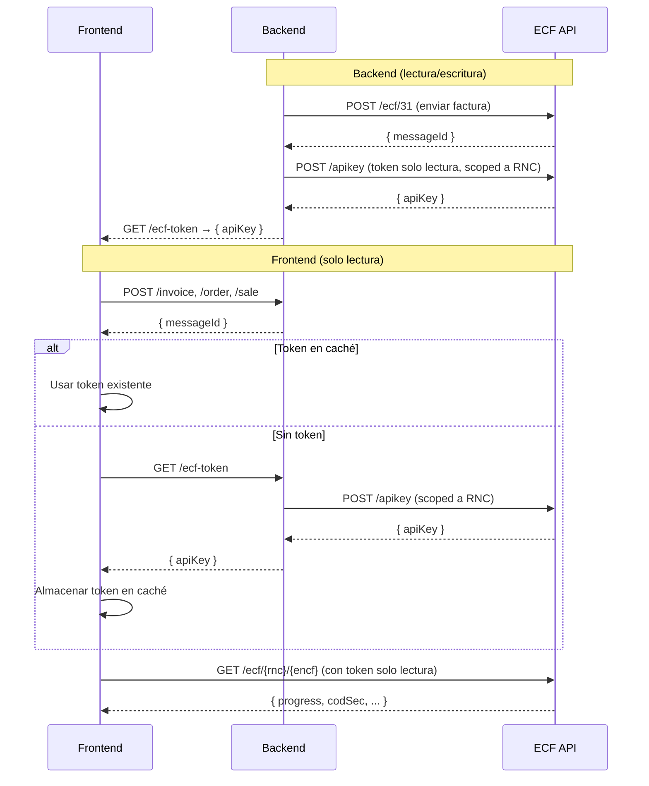

# ecf-dgii

SDK de Python para la **API ECF DGII** — Comprobantes Fiscales Electrónicos de la República Dominicana.

## Instalación

```bash
pip install ecf-dgii
```

## Inicio rápido

```python
import asyncio
from ecf_dgii import EcfClient, ECF, Encabezado, IdDoc, Emisor, Totales, Item, Comprador, FormaDePago, DescuentoORecargo, ImpuestoAdicional, ImpuestoAdicional2

async def main():
    async with EcfClient(api_key="tu-token-jwt", environment="test") as client:
        # Enviar un ECF con enrutamiento automático y polling
        ecf = ECF(
            encabezado=Encabezado(
                version="Version1_0",
                idDoc=IdDoc(
                    tipoeCF="FacturaDeCreditoFiscalElectronica",
                    encf="E310000051630",
                    tipoPago="Contado",
                    tipoIngresos="01",
                    tablaFormasPago=[FormaDePago(formaPago="Efectivo", montoPago=1015.25)],
                    indicadorMontoGravado="ConITBISIncluido",
                    fechaVencimientoSecuencia="2028-12-31T00:00:00",
                ),
                emisor=Emisor(
                    rncEmisor="131460941",
                    razonSocialEmisor="DOCUMENTOS ELECTRONICOS DE 02",
                    direccionEmisor="AVE. ISABEL AGUIAR NO. 269, ZONA INDUSTRIAL DE HERRERA",
                    fechaEmision="2026-01-10",
                ),
                comprador=Comprador(
                    rncComprador="131880681",
                    razonSocialComprador="DOCUMENTOS ELECTRONICOS DE 03",
                ),
                totales=Totales(
                    ITBIS1=18,
                    montoGravadoI1=762.71,
                    montoGravadoTotal=762.71,
                    totalITBIS1=137.29,
                    totalITBIS=137.29,
                    montoNoFacturable=100.0,
                    impuestosAdicionales=[
                        ImpuestoAdicional2(
                            tipoImpuesto="002",
                            tasaImpuestoAdicional=2,
                            otrosImpuestosAdicionales=15.25,
                        )
                    ],
                    montoImpuestoAdicional=15.25,
                    montoTotal=1015.25,
                    montoPeriodo=1015.25,
                ),
            ),
            detallesItems=[
                Item(
                    numeroLinea=1,
                    nombreItem="Iphone 18 Pro max",
                    indicadorFacturacion="ITBIS1_18Percent",
                    indicadorBienoServicio="Bien",
                    cantidadItem=1,
                    unidadMedida="Unidad",
                    precioUnitarioItem=1016.95,
                    montoItem=1016.95,
                    tablaImpuestoAdicional=[ImpuestoAdicional(tipoImpuesto="002")],
                ),
                Item(
                    numeroLinea=2,
                    nombreItem="Costo de Envío",
                    indicadorFacturacion="NoFacturable_18Percent",
                    indicadorBienoServicio="Servicio",
                    cantidadItem=1,
                    unidadMedida="Unidad",
                    precioUnitarioItem=100.0,
                    montoItem=100.0,
                ),
            ],
            descuentosORecargos=[
                DescuentoORecargo(
                    tipoValor="$",
                    tipoAjuste="D",
                    numeroLinea=1,
                    montoDescuentooRecargo=84.75,
                    descripcionDescuentooRecargo="Descuento",
                    indicadorFacturacionDescuentooRecargo="ITBIS1_18Percent",
                ),
            ],
        )

        result = await client.send_ecf(ecf)
        print(f"ECF aceptado: {result.encf} - Estatus: {result.estatus}")

asyncio.run(main())
```

Este es el JSON equivalente que se envía a la API:

```json
{
  "encabezado": {
    "idDoc": {
      "encf": "E310000051630",
      "TipoeCF": "FacturaDeCreditoFiscalElectronica",
      "TipoPago": "Contado",
      "TipoIngresos": "01",
      "TablaFormasPago": [
        {
          "FormaPago": "Efectivo",
          "MontoPago": 1015.25
        }
      ],
      "IndicadorMontoGravado": "ConITBISIncluido",
      "FechaVencimientoSecuencia": "2028-12-31T00:00:00"
    },
    "Emisor": {
      "RNCEmisor": "131460941",
      "FechaEmision": "2026-01-10",
      "DireccionEmisor": "AVE. ISABEL AGUIAR NO. 269, ZONA INDUSTRIAL DE HERRERA",
      "RazonSocialEmisor": "DOCUMENTOS ELECTRONICOS DE 02"
    },
    "Totales": {
      "ITBIS1": 18,
      "MontoGravadoI1": 762.71,
      "MontoGravadoTotal": 762.71,
      "TotalITBIS1": 137.29,
      "TotalITBIS": 137.29,
      "MontoNoFacturable": 100.0,
      "ImpuestosAdicionales": [
        {
          "TipoImpuesto": "002",
          "TasaImpuestoAdicional": 2,
          "OtrosImpuestosAdicionales": 15.25
        }
      ],
      "MontoImpuestoAdicional": 15.25,
      "MontoTotal": 1015.25,
      "MontoPeriodo": 1015.25
    },
    "Version": "Version1_0",
    "Comprador": {
      "RNCComprador": "131880681",
      "RazonSocialComprador": "DOCUMENTOS ELECTRONICOS DE 03"
    }
  },
  "DetallesItems": [
    {
      "MontoItem": 1016.95,
      "NombreItem": "Iphone 18 Pro max",
      "NumeroLinea": 1,
      "CantidadItem": 1,
      "UnidadMedida": "Unidad",
      "PrecioUnitarioItem": 1016.95,
      "IndicadorFacturacion": "ITBIS1_18Percent",
      "IndicadorBienoServicio": "Bien",
      "TablaImpuestoAdicional": [
        {
          "TipoImpuesto": "002"
        }
      ]
    },
    {
      "MontoItem": 100.0,
      "NombreItem": "Costo de Envío",
      "NumeroLinea": 2,
      "CantidadItem": 1,
      "UnidadMedida": "Unidad",
      "PrecioUnitarioItem": 100.0,
      "IndicadorFacturacion": "NoFacturable_18Percent",
      "IndicadorBienoServicio": "Servicio"
    }
  ],
  "DescuentosORecargos": [
    {
      "TipoValor": "$",
      "TipoAjuste": "D",
      "NumeroLinea": 1,
      "MontoDescuentooRecargo": 84.75,
      "DescripcionDescuentooRecargo": "Descuento",
      "IndicadorFacturacionDescuentooRecargo": "ITBIS1_18Percent"
    }
  ]
}
```

## Configuración

### Autenticación

El API key (token JWT Bearer) se puede proporcionar de dos formas:

```python
# Parámetro directo
client = EcfClient(api_key="tu-token-jwt")

# Variable de entorno
# export ECF_API_KEY=tu-token-jwt
client = EcfClient()
```

### Ambientes

```python
client = EcfClient(api_key="...", environment="test")   # Pruebas
client = EcfClient(api_key="...", environment="cert")   # Certificación
client = EcfClient(api_key="...", environment="prod")   # Producción

# URL base personalizada
client = EcfClient(api_key="...", base_url="https://custom.api.url")
```

## Funcionalidades

### Enviar ECF con polling automático

El método `send_ecf` maneja:
- **Enrutamiento** — selecciona automáticamente el endpoint correcto según el tipo de ECF
- **Polling** — espera el procesamiento de DGII con backoff exponencial
- **Manejo de errores** — lanza `EcfProcessingError` si DGII rechaza el ECF

```python
from ecf_dgii import PollingOptions

result = await client.send_ecf(
    ecf,
    polling_options=PollingOptions(
        initial_delay=1.0,     # segundos
        max_delay=30.0,        # segundos
        max_retries=60,
        backoff_multiplier=2.0,
        timeout=300.0,         # timeout total en segundos
    ),
)
```

### Arquitectura Backend / Frontend



### Flujo detallado

**Backend** (usa `EcfClient` con permisos de lectura/escritura):

1. Tu backend recibe la factura del usuario (ej. `POST /invoice`)
2. Valida, guarda y convierte la factura interna al formato ECF
3. Envía el ECF a la API usando el token principal → recibe `messageId`
4. Expone un endpoint `GET /ecf-token` que llama a `POST /apikey` de ECF SSD y retorna un **token de solo lectura** con alcance al RNC del tenant

**Frontend** (usa `EcfFrontendClient`):

1. El usuario invoca un endpoint del backend (`/invoice`, `/order`, `/sale`) → recibe el `messageId`
2. Verifica si hay un token en caché (memoria, localStorage, etc.)
   - **Si existe**: lo usa directamente
   - **Si no existe**: llama a `GET /ecf-token` del backend, almacena el token retornado en caché
3. Crea el cliente de solo lectura con el token
4. Consulta el estado del ECF directamente contra la API de ECF SSD

### Ejemplo: Backend

En la mayoría de aplicaciones, el backend maneja la lógica de negocio y envía el ECF:

```python
ecf_client = EcfClient(api_key=os.environ["ECF_BACKEND_TOKEN"], environment="prod")

# Tu endpoint de facturas — lógica de negocio + envío a ECF SSD
@app.post("/api/v1/invoices")
async def create_invoice(request: CreateInvoiceRequest):
    # 1. Validar y guardar tu factura interna
    invoice = await validate_and_save(request)
    # 2. Convertir a formato ECF
    ecf = convert_to_ecf(invoice)
    # 3. Enviar a ECF SSD (sin polling)
    response = await ecf_client.raw_post("/ecf/31", ecf)
    await update_invoice(invoice.id, message_id=response["messageId"])
    return {"id": invoice.id, "messageId": response["messageId"]}

# Endpoint separado: generar token de solo lectura para el frontend
@app.get("/api/v1/ecf-token")
async def get_ecf_token():
    api_key = await ecf_client.create_api_key({...})  # limitado al tenant/RNC
    return {"token": api_key["token"]}
```

El frontend almacena el token de forma segura, lo renueva en caso de `401` o expiración, y consulta ECF SSD directamente. Ver el [README principal](../README.md#arquitectura-backend--frontend) para el diagrama completo.

> **`send_ecf`** envuelve envío + polling en una sola llamada. Para aplicaciones con frontend, usa los endpoints individuales.

### Gestión de empresas

```python
# Listar empresas
companies = await client.get_companies(page=1, limit=10)

# Obtener por RNC
company = await client.get_company_by_rnc("123456789")

# Crear o actualizar
from ecf_dgii import UpsertCompanyRequest
await client.upsert_company(UpsertCompanyRequest(
    rnc="123456789",
    legalName="Mi Empresa SRL",
    name="Mi Empresa",
))

# Eliminar
await client.delete_company("123456789")
```

### Gestión de certificados

```python
# Obtener certificados
certs = await client.get_certificate("123456789")

# Subir certificado
with open("cert.p12", "rb") as f:
    await client.update_certificate("123456789", f, password="cert-password")
```

### Consultar ECFs

```python
# Consultar por RNC y eNCF
results = await client.query_ecf("123456789", "E310000000001")

# Buscar con filtros
from ecf_dgii import AllTipoECFTypes
page = await client.search_ecfs(
    "123456789",
    tipos_ecfs=[AllTipoECFTypes.FACTURA_DE_CREDITO_FISCAL_ELECTRONICA],
    from_fecha_emision="2024-01-01T00:00:00",
    page=1,
    limit=50,
)
```

### Aprobación comercial

```python
from ecf_dgii import SendAcecfRequest, EstadoType
await client.aprobacion_comercial(
    "123456789",
    "E310000000001",
    SendAcecfRequest(estadoType=EstadoType.ECF_ACEPTADO),
)
```

### Anulación de rangos

```python
from ecf_dgii import AnulacionRequest, DetalleAnulacionRequest, SecuenciaRequest, ECFType
result = await client.anulacion_rangos(
    "123456789",
    AnulacionRequest(
        cantidaDeNcfAnulados=5,
        detalleAnulacion=[
            DetalleAnulacionRequest(
                tipoEcf=ECFType.ECF31,
                cantidadeNcfAnulados=5,
                noLinea=[1],
                secuencias=[SecuenciaRequest(desdeEncf="E310000000001", hastaEncf="E310000000005")],
            ),
        ],
    ),
)
```

### Consultas DGII

```python
# Directorio
entries = await client.consulta_directorio_listado("123456789")

# Estado
estado = await client.consulta_estado(
    "123456789",
    rnc_emisor="123456789",
    ncf_electronico="E310000000001",
    rnc_comprador="987654321",
    codigo_seguridad="ABC123",
)

# Estatus servicios
servicios = await client.estatus_servicios("123456789")
```

## Manejo de errores

```python
from ecf_dgii import (
    EcfApiError,
    EcfValidationError,
    EcfAuthenticationError,
    EcfProcessingError,
    PollingTimeoutError,
)

try:
    result = await client.send_ecf(ecf)
except EcfValidationError as e:
    print(f"Solicitud inválida: {e.detail}")
except EcfAuthenticationError:
    print("API key inválido")
except EcfProcessingError as e:
    print(f"DGII rechazó: {e.response.errors}")
except PollingTimeoutError:
    print("El procesamiento tomó demasiado tiempo")
except EcfApiError as e:
    print(f"Error de API {e.status_code}: {e}")
```

## Licencia

MIT
