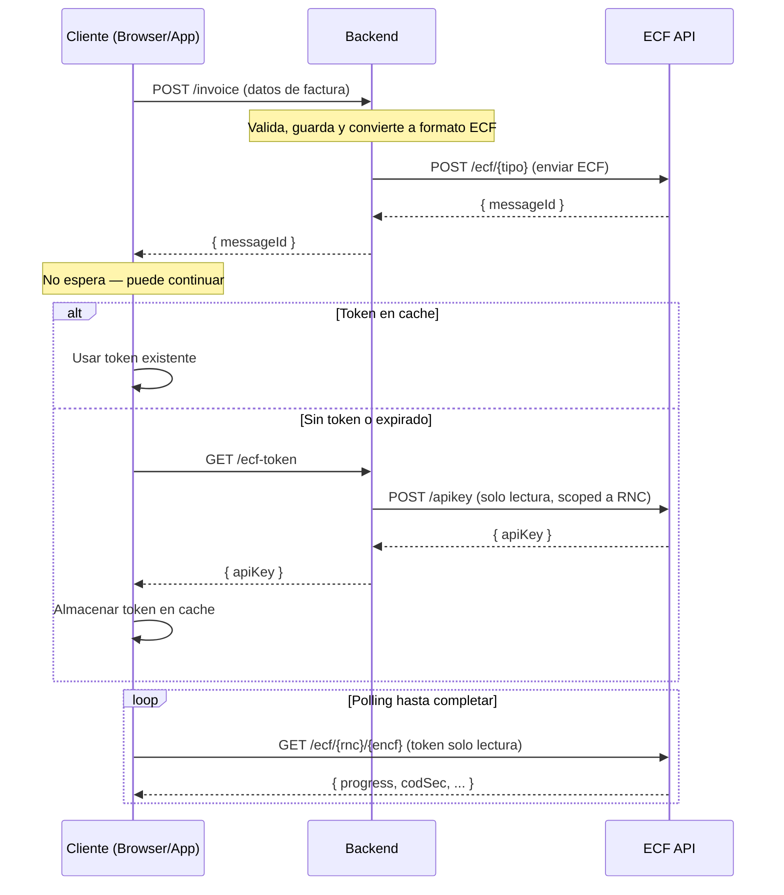

# @ssddo/ecf-react

[](https://www.npmjs.com/package/@ssddo/ecf-react)
[](https://www.npmjs.com/package/@ssddo/ecf-react)
[](LICENSE)

Hooks de React Query para la API de ECF DGII (comprobantes fiscales electrónicos de República Dominicana). Construido sobre `openapi-react-query` y `openapi-fetch` para interacciones con la API completamente tipadas.

## Instalación

```bash
npm install @ssddo/ecf-react @tanstack/react-query
```

## Configuración

Envuelve tu aplicación con `QueryClientProvider` y crea el cliente ECF:

```tsx
import { QueryClient, QueryClientProvider } from '@tanstack/react-query';
import { createEcfReactClient } from '@ssddo/ecf-react';

const queryClient = new QueryClient();

const { $api } = createEcfReactClient({
  apiKey: 'tu-api-key',
  environment: 'test', // 'test' | 'cert' | 'prod'
});

function App() {
  return (
    <QueryClientProvider client={queryClient}>
      <TuApp />
    </QueryClientProvider>
  );
}
```

También puedes proporcionar una URL base personalizada en lugar de usar un entorno predefinido:

```tsx
const { $api } = createEcfReactClient({
  apiKey: 'tu-api-key',
  baseUrl: 'https://api-personalizada.ejemplo.com',
});
```

## Uso

### Consultar datos

Usa el objeto `$api` para acceder a hooks tipados de React Query para cada endpoint:

```tsx
function Empresas() {
  const { data, isLoading, error } = $api.useQuery('get', '/company', {
    params: { query: { Page: 1, Limit: 10 } },
  });

  if (isLoading) return <div>Cargando...</div>;
  if (error) return <div>Error: {error.message}</div>;

  return (
    <ul>
      {data?.data?.map((company) => (
        <li key={company.rnc}>{company.name}</li>
      ))}
    </ul>
  );
}
```

### Buscar ECFs

```tsx
function BuscarEcf({ rnc }: { rnc: string }) {
  const { data } = $api.useQuery('get', '/ecf/{rnc}', {
    params: { path: { rnc } },
  });

  return <pre>{JSON.stringify(data, null, 2)}</pre>;
}
```

### Enviar ECFs (Mutaciones)

```tsx
function EnviarEcf() {
  const mutation = $api.useMutation('post', '/ecf/31');

  const handleSend = () => {
    mutation.mutate({
      body: {
        Encabezado: {
          IdDoc: {
            ENCF: "E310000051630",
            TipoeCF: "FacturaDeCreditoFiscalElectronica",
            TipoPago: "Contado",
            TipoIngresos: "01",
            TablaFormasPago: [
              { FormaPago: "Efectivo", MontoPago: 1015.25 },
            ],
            IndicadorMontoGravado: "ConITBISIncluido",
            FechaVencimientoSecuencia: "2028-12-31T00:00:00",
          },
          Emisor: {
            RNCEmisor: "131460941",
            FechaEmision: "2026-01-10",
            DireccionEmisor: "AVE. ISABEL AGUIAR NO. 269, ZONA INDUSTRIAL DE HERRERA",
            RazonSocialEmisor: "DOCUMENTOS ELECTRONICOS DE 02",
          },
          Totales: {
            ITBIS1: 18,
            MontoGravadoI1: 762.71,
            MontoGravadoTotal: 762.71,
            TotalITBIS1: 137.29,
            TotalITBIS: 137.29,
            MontoNoFacturable: 100.0,
            ImpuestosAdicionales: [
              {
                TipoImpuesto: "002",
                TasaImpuestoAdicional: 2,
                OtrosImpuestosAdicionales: 15.25,
              },
            ],
            MontoImpuestoAdicional: 15.25,
            MontoTotal: 1015.25,
            MontoPeriodo: 1015.25,
          },
          Version: "Version1_0",
          Comprador: {
            RNCComprador: "131880681",
            RazonSocialComprador: "DOCUMENTOS ELECTRONICOS DE 03",
          },
        },
        DetallesItems: [
          {
            MontoItem: 1016.95,
            NombreItem: "Iphone 18 Pro max",
            NumeroLinea: 1,
            CantidadItem: 1,
            UnidadMedida: "Unidad",
            PrecioUnitarioItem: 1016.95,
            IndicadorFacturacion: "ITBIS1_18Percent",
            IndicadorBienoServicio: "Bien",
            TablaImpuestoAdicional: [{ TipoImpuesto: "002" }],
          },
          {
            MontoItem: 100.0,
            NombreItem: "Costo de Envío",
            NumeroLinea: 2,
            CantidadItem: 1,
            UnidadMedida: "Unidad",
            PrecioUnitarioItem: 100.0,
            IndicadorFacturacion: "NoFacturable_18Percent",
            IndicadorBienoServicio: "Servicio",
          },
        ],
        DescuentosORecargos: [
          {
            TipoValor: "$",
            TipoAjuste: "D",
            NumeroLinea: 1,
            MontoDescuentooRecargo: 84.75,
            DescripcionDescuentooRecargo: "Descuento",
            IndicadorFacturacionDescuentooRecargo: "ITBIS1_18Percent",
          },
        ],
      },
    });
  };

  return (
    <div>
      <button onClick={handleSend} disabled={mutation.isPending}>
        {mutation.isPending ? 'Enviando...' : 'Enviar ECF'}
      </button>
      {mutation.isSuccess && <p>ECF enviado exitosamente!</p>}
      {mutation.isError && <p>Error: {mutation.error.message}</p>}
    </div>
  );
}
```

## Entornos

| Entorno | URL |
|---------|-----|
| `test` | `https://api.test.ecfx.ssd.com.do` |
| `cert` | `https://api.cert.ecfx.ssd.com.do` |
| `prod` | `https://api.prod.ecfx.ssd.com.do` |

## Referencia de la API

### `createEcfReactClient(config)`

Crea un cliente tipado de React Query para la API de ECF DGII.

**Opciones de configuración:**

| Opción | Tipo | Requerido | Descripción |
|--------|------|-----------|-------------|
| `apiKey` | `string` | Sí | Tu API key para autenticación |
| `environment` | `'test' \| 'cert' \| 'prod'` | No | Entorno destino (por defecto: `'test'`) |
| `baseUrl` | `string` | No | URL base personalizada (sobreescribe `environment`) |

**Retorna:** `{ $api, fetchClient }`

- `$api` - El cliente openapi-react-query con `useQuery`, `useMutation`, `useSuspenseQuery`, etc.
- `fetchClient` - El cliente openapi-fetch subyacente para uso fuera de React.

### `createEcfFrontendReactClient(config)`

Crea un cliente de solo lectura restringido a endpoints GET. No expone `useMutation`. Diseñado para el cliente donde solo se consultan ECFs con un token de solo lectura. Maneja automáticamente el caching de tokens y refresh en caso de 401.

**Opciones de configuración:**

| Opción | Tipo | Requerido | Descripción |
|--------|------|-----------|-------------|
| `getToken` | `() => Promise<string>` | Sí | Callback para obtener un token fresco (ej. fetch a tu backend) |
| `cacheToken` | `(token: string) => Promise<void>` | No | Callback para almacenar el token (por defecto: `localStorage`) |
| `getCachedToken` | `() => Promise<string \| null>` | No | Callback para leer el token del cache (por defecto: `localStorage`) |
| `environment` | `'test' \| 'cert' \| 'prod'` | No | Entorno destino (por defecto: `'test'`) |
| `baseUrl` | `string` | No | URL base personalizada (sobreescribe `environment`) |

**Retorna:** `{ $api, fetchClient }`

- `$api` - Cliente con solo `useQuery`, `useSuspenseQuery`, y `queryOptions` (sin `useMutation`)
- `fetchClient` - El cliente openapi-fetch subyacente (restringido a paths GET)

## Arquitectura Backend / Frontend



### Flujo detallado

1. El **cliente** (browser/app) envía los datos de la factura al **backend** (`POST /invoice`, `/order`, `/sale`)
2. El **backend** valida, guarda y convierte la factura interna al formato ECF
3. El **backend** envía el ECF a la API de ECF SSD (`POST /ecf/{tipo}`) y recibe un `messageId`
4. El **backend** retorna el `messageId` al cliente — **el cliente no espera**, puede continuar
5. Cuando el cliente necesita consultar el estado del ECF, usa `EcfFrontendClient` que internamente:
   - Verifica si hay un **token de solo lectura** en cache
   - Si **no existe o expiró**: llama a `getToken()` (que el consumidor provee — típicamente un `fetch('/ecf-token')` a su backend), luego llama a `cacheToken(token)` para almacenarlo
   - Si la API retorna **401**: automáticamente llama a `getToken()` de nuevo, actualiza el cache, y reintenta
6. El cliente hace **polling** directamente contra la API de ECF SSD (`GET /ecf/{rnc}/{encf}`) hasta que `progress` sea `Finished`

```tsx
import { createEcfFrontendReactClient } from '@ssddo/ecf-react';

// 1. Crear cliente de solo lectura (getToken se llama automáticamente)
const { $api } = createEcfFrontendReactClient({
  getToken: async () => {
    const res = await fetch('/api/v1/ecf-token');
    const { apiKey } = await res.json();
    return apiKey;
  },
  environment: 'prod',
});

// 2. El componente que envía la factura al backend
function EnviarFactura() {
  const handleSubmit = async (invoiceData) => {
    // Enviar factura al backend — el cliente no espera por el procesamiento ECF
    const res = await fetch('/api/v1/invoices', {
      method: 'POST',
      body: JSON.stringify(invoiceData),
    });
    const { messageId, rnc, encf } = await res.json();
    // Navegar a la página de estado o mostrar el componente de polling
    navigate(`/ecf-status/${rnc}/${encf}`);
  };
}

// 3. El componente que consulta el estado del ECF (polling automático)
function EstadoEcf({ rnc, encf }: { rnc: string; encf: string }) {
  const { data } = $api.useQuery('get', '/ecf/{rnc}/{encf}', {
    params: { path: { rnc, encf } },
    refetchInterval: 3000,
  });

  if (data?.progress === 'Finished') {
    return <p>Comprobante aceptado — código: {data.codSec}</p>;
  }
  return <p>Procesando... ({data?.progress})</p>;
}
```

## Uso fuera de React

Para aplicaciones del lado del servidor o sin React, usa el SDK base de TypeScript: [`@ssddo/ecf-sdk`](https://www.npmjs.com/package/@ssddo/ecf-sdk).
