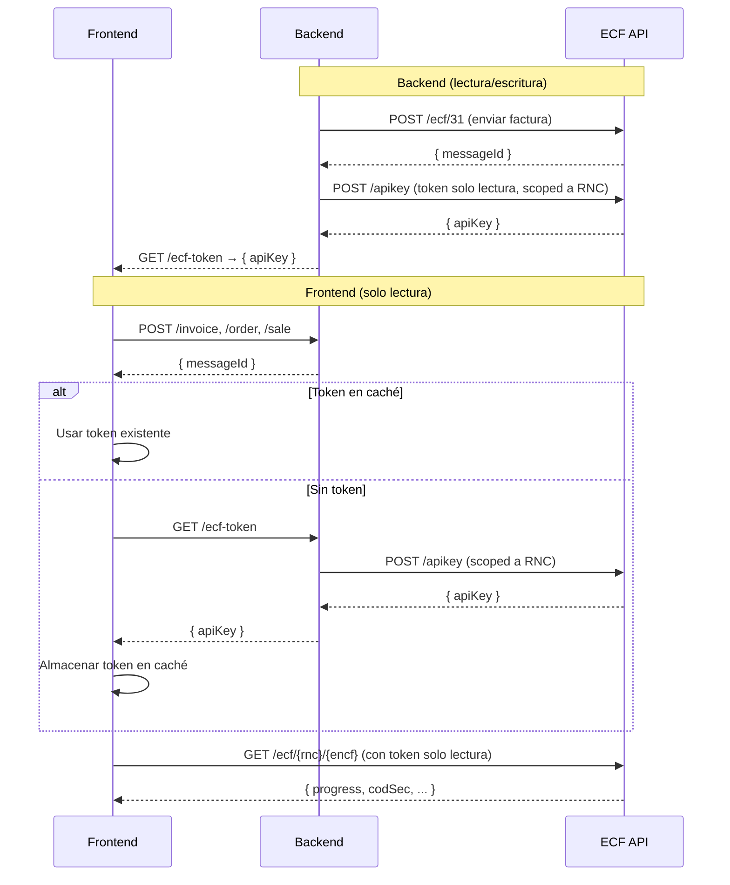

# @ssddo/ecf-react

Hooks de React Query para la API de ECF DGII (comprobantes fiscales electrónicos de República Dominicana). Construido sobre `openapi-react-query` y `openapi-fetch` para interacciones con la API completamente tipadas.

## Instalación

```bash
npm install @ssddo/ecf-react @tanstack/react-query
```

## Configuración

Envuelve tu aplicación con `QueryClientProvider` y crea el cliente ECF:

```tsx
import { QueryClient, QueryClientProvider } from '@tanstack/react-query';
import { createEcfReactClient } from '@ssddo/ecf-react';

const queryClient = new QueryClient();

const { $api } = createEcfReactClient({
  apiKey: 'tu-api-key',
  environment: 'test', // 'test' | 'cert' | 'prod'
});

function App() {
  return (
    <QueryClientProvider client={queryClient}>
      <TuApp />
    </QueryClientProvider>
  );
}
```

También puedes proporcionar una URL base personalizada en lugar de usar un entorno predefinido:

```tsx
const { $api } = createEcfReactClient({
  apiKey: 'tu-api-key',
  baseUrl: 'https://api-personalizada.ejemplo.com',
});
```

## Uso

### Consultar datos

Usa el objeto `$api` para acceder a hooks tipados de React Query para cada endpoint:

```tsx
function Empresas() {
  const { data, isLoading, error } = $api.useQuery('get', '/company', {
    params: { query: { Page: 1, Limit: 10 } },
  });

  if (isLoading) return <div>Cargando...</div>;
  if (error) return <div>Error: {error.message}</div>;

  return (
    <ul>
      {data?.data?.map((company) => (
        <li key={company.rnc}>{company.name}</li>
      ))}
    </ul>
  );
}
```

### Buscar ECFs

```tsx
function BuscarEcf({ rnc }: { rnc: string }) {
  const { data } = $api.useQuery('get', '/ecf/{rnc}', {
    params: { path: { rnc } },
  });

  return <pre>{JSON.stringify(data, null, 2)}</pre>;
}
```

### Enviar ECFs (Mutaciones)

```tsx
function EnviarEcf() {
  const mutation = $api.useMutation('post', '/ecf/31');

  const handleSend = () => {
    mutation.mutate({
      body: {
        Encabezado: {
          IdDoc: {
            ENCF: "E310000051630",
            TipoeCF: "FacturaDeCreditoFiscalElectronica",
            TipoPago: "Contado",
            TipoIngresos: "01",
            TablaFormasPago: [
              { FormaPago: "Efectivo", MontoPago: 1015.25 },
            ],
            IndicadorMontoGravado: "ConITBISIncluido",
            FechaVencimientoSecuencia: "2028-12-31T00:00:00",
          },
          Emisor: {
            RNCEmisor: "131460941",
            FechaEmision: "2026-01-10",
            DireccionEmisor: "AVE. ISABEL AGUIAR NO. 269, ZONA INDUSTRIAL DE HERRERA",
            RazonSocialEmisor: "DOCUMENTOS ELECTRONICOS DE 02",
          },
          Totales: {
            ITBIS1: 18,
            MontoGravadoI1: 762.71,
            MontoGravadoTotal: 762.71,
            TotalITBIS1: 137.29,
            TotalITBIS: 137.29,
            MontoNoFacturable: 100.0,
            ImpuestosAdicionales: [
              {
                TipoImpuesto: "002",
                TasaImpuestoAdicional: 2,
                OtrosImpuestosAdicionales: 15.25,
              },
            ],
            MontoImpuestoAdicional: 15.25,
            MontoTotal: 1015.25,
            MontoPeriodo: 1015.25,
          },
          Version: "Version1_0",
          Comprador: {
            RNCComprador: "131880681",
            RazonSocialComprador: "DOCUMENTOS ELECTRONICOS DE 03",
          },
        },
        DetallesItems: [
          {
            MontoItem: 1016.95,
            NombreItem: "Iphone 18 Pro max",
            NumeroLinea: 1,
            CantidadItem: 1,
            UnidadMedida: "Unidad",
            PrecioUnitarioItem: 1016.95,
            IndicadorFacturacion: "ITBIS1_18Percent",
            IndicadorBienoServicio: "Bien",
            TablaImpuestoAdicional: [{ TipoImpuesto: "002" }],
          },
          {
            MontoItem: 100.0,
            NombreItem: "Costo de Envío",
            NumeroLinea: 2,
            CantidadItem: 1,
            UnidadMedida: "Unidad",
            PrecioUnitarioItem: 100.0,
            IndicadorFacturacion: "NoFacturable_18Percent",
            IndicadorBienoServicio: "Servicio",
          },
        ],
        DescuentosORecargos: [
          {
            TipoValor: "$",
            TipoAjuste: "D",
            NumeroLinea: 1,
            MontoDescuentooRecargo: 84.75,
            DescripcionDescuentooRecargo: "Descuento",
            IndicadorFacturacionDescuentooRecargo: "ITBIS1_18Percent",
          },
        ],
      },
    });
  };

  return (
    <div>
      <button onClick={handleSend} disabled={mutation.isPending}>
        {mutation.isPending ? 'Enviando...' : 'Enviar ECF'}
      </button>
      {mutation.isSuccess && <p>ECF enviado exitosamente!</p>}
      {mutation.isError && <p>Error: {mutation.error.message}</p>}
    </div>
  );
}
```

## Entornos

| Entorno | URL |
|---------|-----|
| `test` | `https://api.test.ecfx.ssd.com.do` |
| `cert` | `https://api.cert.ecfx.ssd.com.do` |
| `prod` | `https://api.prod.ecfx.ssd.com.do` |

## Referencia de la API

### `createEcfReactClient(config)`

Crea un cliente tipado de React Query para la API de ECF DGII.

**Opciones de configuración:**

| Opción | Tipo | Requerido | Descripción |
|--------|------|-----------|-------------|
| `apiKey` | `string` | Sí | Tu API key para autenticación |
| `environment` | `'test' \| 'cert' \| 'prod'` | No | Entorno destino (por defecto: `'test'`) |
| `baseUrl` | `string` | No | URL base personalizada (sobreescribe `environment`) |

**Retorna:** `{ $api, fetchClient }`

- `$api` - El cliente openapi-react-query con `useQuery`, `useMutation`, `useSuspenseQuery`, etc.
- `fetchClient` - El cliente openapi-fetch subyacente para uso fuera de React.

### `createEcfFrontendReactClient(config)`

Crea un cliente de solo lectura restringido a endpoints GET. No expone `useMutation`. Diseñado para el frontend donde solo se consultan ECFs con un token de solo lectura.

**Opciones de configuración:** mismas que `createEcfReactClient`.

**Retorna:** `{ $api, fetchClient }`

- `$api` - Cliente con solo `useQuery`, `useSuspenseQuery`, y `queryOptions` (sin `useMutation`)
- `fetchClient` - El cliente openapi-fetch subyacente (restringido a paths GET)

```tsx
import { createEcfFrontendReactClient } from '@ssddo/ecf-react';

const { $api } = createEcfFrontendReactClient({
  apiKey: token,
  environment: 'prod',
});

// ✅ Funciona — endpoint GET
$api.useQuery('get', '/ecf/{rnc}/{encf}', { params: { path: { rnc, encf } } });

// ❌ Error de tipo — useMutation no está disponible
// $api.useMutation('post', '/ecf/31');
```

## Arquitectura Backend / Frontend



### Flujo detallado

**Backend** (usa `@ssddo/ecf-sdk` o la librería del lenguaje correspondiente con permisos de lectura/escritura):

1. Tu backend recibe la factura del usuario (ej. `POST /invoice`)
2. Valida, guarda y convierte la factura interna al formato ECF
3. Envía el ECF a la API usando el token principal → recibe `messageId`
4. Expone un endpoint `GET /ecf-token` que llama a `POST /apikey` de ECF SSD y retorna un **token de solo lectura** con alcance al RNC del tenant

**Frontend** (usa `@ssddo/ecf-react` con `createEcfFrontendReactClient`):

1. El usuario invoca un endpoint del backend (`/invoice`, `/order`, `/sale`) → recibe el `messageId`
2. Verifica si hay un token en caché (memoria, localStorage, etc.)
   - **Si existe**: lo usa directamente
   - **Si no existe**: llama a `GET /ecf-token` del backend, almacena el token retornado en caché
3. Crea el cliente de solo lectura con el token
4. Consulta el estado del ECF directamente contra la API de ECF SSD

### Ejemplo completo

```tsx
import { createEcfFrontendReactClient } from '@ssddo/ecf-react';

// Hook personalizado para gestión de token
function useEcfToken() {
  // 1. Verificar caché local
  // 2. Si no hay token o expiró → llamar a GET /ecf-token del backend
  // 3. Almacenar en caché y retornar
  // 4. Renovar ante 401 o expiración
}

const ecfToken = useEcfToken();

const { $api } = createEcfFrontendReactClient({
  apiKey: ecfToken,  // solo lectura, scoped al RNC del tenant
  environment: 'prod',
});

function EstadoEcf({ rnc, encf }: { rnc: string; encf: string }) {
  // Consulta ECF SSD directamente — no se necesita proxy en el backend
  const { data } = $api.useQuery('get', '/ecf/{rnc}/{encf}', {
    params: { path: { rnc, encf } },
    refetchInterval: 3000,
  });

  if (data?.progress === 'Finished') {
    return (
      <div>
        <p>Comprobante aceptado</p>
        <p>Código seguridad: {data.codSec}</p>
        <QRCode value={data.impresionUrl} />
      </div>
    );
  }

  return <p>Procesando... ({data?.progress})</p>;
}
```

Este patrón descarga el polling de tu backend y permite que el frontend se comunique directamente con ECF SSD usando un token restringido. Consulta el [README principal](../README.md#arquitectura-backend--frontend) para más detalles.

## Uso fuera de React

Para aplicaciones del lado del servidor o sin React, usa el SDK base de TypeScript: [`@ssddo/ecf-sdk`](https://www.npmjs.com/package/@ssddo/ecf-sdk).
