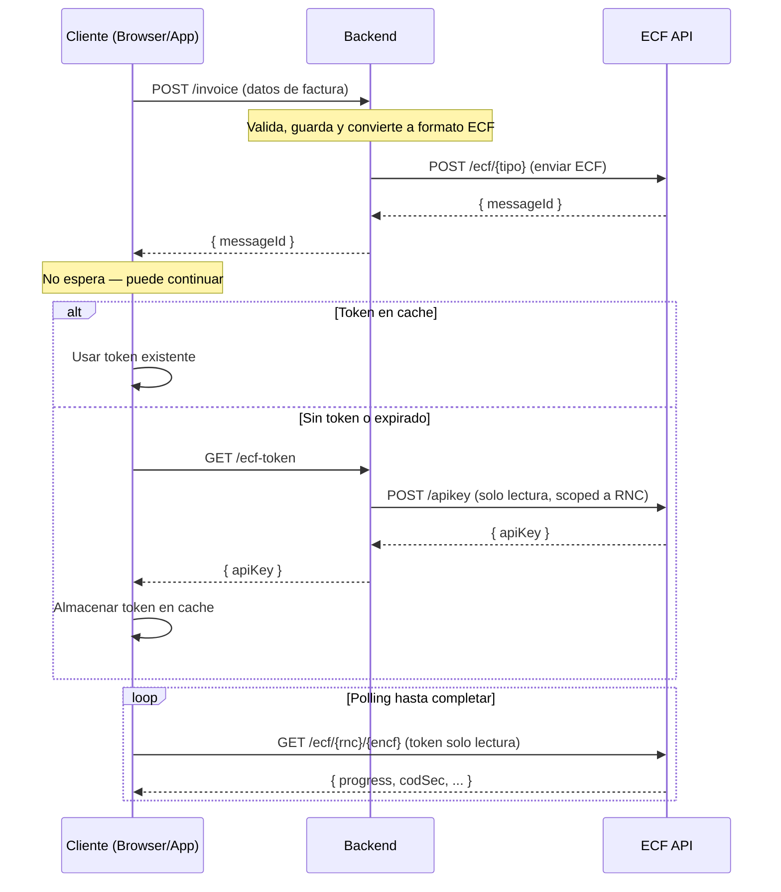

# @ssddo/ecf-sdk

[](https://www.npmjs.com/package/@ssddo/ecf-sdk)
[](https://www.npmjs.com/package/@ssddo/ecf-sdk)
[](LICENSE)

SDK de TypeScript para la API de ECF DGII (comprobantes fiscales electrónicos de República Dominicana).

Construido con [openapi-typescript](https://github.com/openapi-ts/openapi-typescript) y [openapi-fetch](https://github.com/openapi-ts/openapi-typescript/tree/main/packages/openapi-fetch) para acceso a la API completamente tipado.

## Instalación

```bash
npm install @ssddo/ecf-sdk
```

## Inicio rápido

```typescript
import { EcfClient } from '@ssddo/ecf-sdk';

const client = new EcfClient({
  apiKey: 'tu-token-jwt',
  environment: 'test', // 'test' | 'cert' | 'prod'
});

// Enviar un ECF y esperar a que termine de procesarse
const result = await client.sendEcf({
  Encabezado: {
    IdDoc: {
      ENCF: "E310000051630",
      TipoeCF: "FacturaDeCreditoFiscalElectronica",
      TipoPago: "Contado",
      TipoIngresos: "01",
      TablaFormasPago: [
        { FormaPago: "Efectivo", MontoPago: 1015.25 },
      ],
      IndicadorMontoGravado: "ConITBISIncluido",
      FechaVencimientoSecuencia: "2028-12-31T00:00:00",
    },
    Emisor: {
      RNCEmisor: "131460941",
      FechaEmision: "2026-01-10",
      DireccionEmisor: "AVE. ISABEL AGUIAR NO. 269, ZONA INDUSTRIAL DE HERRERA",
      RazonSocialEmisor: "DOCUMENTOS ELECTRONICOS DE 02",
    },
    Totales: {
      ITBIS1: 18,
      MontoGravadoI1: 762.71,
      MontoGravadoTotal: 762.71,
      TotalITBIS1: 137.29,
      TotalITBIS: 137.29,
      MontoNoFacturable: 100.0,
      ImpuestosAdicionales: [
        {
          TipoImpuesto: "002",
          TasaImpuestoAdicional: 2,
          OtrosImpuestosAdicionales: 15.25,
        },
      ],
      MontoImpuestoAdicional: 15.25,
      MontoTotal: 1015.25,
      MontoPeriodo: 1015.25,
    },
    Version: "Version1_0",
    Comprador: {
      RNCComprador: "131880681",
      RazonSocialComprador: "DOCUMENTOS ELECTRONICOS DE 03",
    },
  },
  DetallesItems: [
    {
      MontoItem: 1016.95,
      NombreItem: "Iphone 18 Pro max",
      NumeroLinea: 1,
      CantidadItem: 1,
      UnidadMedida: "Unidad",
      PrecioUnitarioItem: 1016.95,
      IndicadorFacturacion: "ITBIS1_18Percent",
      IndicadorBienoServicio: "Bien",
      TablaImpuestoAdicional: [{ TipoImpuesto: "002" }],
    },
    {
      MontoItem: 100.0,
      NombreItem: "Costo de Envío",
      NumeroLinea: 2,
      CantidadItem: 1,
      UnidadMedida: "Unidad",
      PrecioUnitarioItem: 100.0,
      IndicadorFacturacion: "NoFacturable_18Percent",
      IndicadorBienoServicio: "Servicio",
    },
  ],
  DescuentosORecargos: [
    {
      TipoValor: "$",
      TipoAjuste: "D",
      NumeroLinea: 1,
      MontoDescuentooRecargo: 84.75,
      DescripcionDescuentooRecargo: "Descuento",
      IndicadorFacturacionDescuentooRecargo: "ITBIS1_18Percent",
    },
  ],
});

console.log(result.progress); // 'Finished'
console.log(result.encf);
```

## Configuración de entorno

```typescript
// Usando un entorno específico
const client = new EcfClient({
  apiKey: 'tu-token-jwt',
  environment: 'prod',
});

// Usando una URL base personalizada (sobreescribe el entorno)
const client = new EcfClient({
  apiKey: 'tu-token-jwt',
  baseUrl: 'https://api-personalizada.ejemplo.com',
});
```

### URLs de entorno

| Entorno | URL |
|---------|-----|
| `test` | `https://api.test.ecfx.ssd.com.do` |
| `cert` | `https://api.cert.ecfx.ssd.com.do` |
| `prod` | `https://api.prod.ecfx.ssd.com.do` |

## Opciones de polling

El método `sendEcf` hace polling hasta que el ECF sea procesado. Puedes personalizar el comportamiento:

```typescript
const result = await client.sendEcf(ecf, {
  initialDelay: 1000,      // Iniciar polling después de 1s (por defecto)
  maxDelay: 30000,          // Delay máximo entre polls (por defecto)
  maxRetries: 60,           // Máximo de intentos de poll (por defecto)
  backoffMultiplier: 2,     // Multiplicador de backoff exponencial (por defecto)
  timeout: 120000,          // Timeout total en ms
  signal: abortController.signal, // AbortSignal para cancelación
});
```

## Arquitectura Backend / Frontend



### Flujo detallado

1. El **cliente** (browser/app) envía los datos de la factura al **backend** (`POST /invoice`, `/order`, `/sale`)
2. El **backend** valida, guarda y convierte la factura interna al formato ECF
3. El **backend** envía el ECF a la API de ECF SSD (`POST /ecf/{tipo}`) y recibe un `messageId`
4. El **backend** retorna el `messageId` al cliente — **el cliente no espera**, puede continuar
5. Cuando el cliente necesita consultar el estado del ECF, usa `EcfFrontendClient` que internamente:
   - Verifica si hay un **token de solo lectura** en cache
   - Si **no existe o expiró**: llama a `getToken()` (que el consumidor provee — típicamente un `fetch('/ecf-token')` a su backend), luego llama a `cacheToken(token)` para almacenarlo
   - Si la API retorna **401**: automáticamente llama a `getToken()` de nuevo, actualiza el cache, y reintenta
6. El cliente hace **polling** directamente contra la API de ECF SSD (`GET /ecf/{rnc}/{encf}`) hasta que `progress` sea `Finished`

### Ejemplo: Backend

```typescript
import { EcfClient } from '@ssddo/ecf-sdk';

const ecfClient = new EcfClient({
  apiKey: process.env.ECF_BACKEND_TOKEN,
  environment: 'prod',
});

// Endpoint de facturación
app.post('/api/v1/invoices', async (req, res) => {
  const invoice = await validateAndSave(req.body);
  const ecf = convertToEcf(invoice);
  const { data } = await ecfClient.raw.POST('/ecf/31', { body: ecf });
  await updateInvoice(invoice.id, { messageId: data.messageId });
  res.json({ id: invoice.id, messageId: data.messageId });
});

// Generar token de solo lectura para el cliente
app.get('/api/v1/ecf-token', async (req, res) => {
  const { data } = await ecfClient.createApiKey({ rnc: tenant.rnc });
  res.json({ apiKey: data.token });
});
```

### Ejemplo: Frontend (con `EcfFrontendClient`)

```typescript
import { createFrontendClient } from '@ssddo/ecf-sdk';

// 1. Enviar la factura al backend
const invoiceRes = await fetch('/api/v1/invoices', {
  method: 'POST',
  body: JSON.stringify(invoiceData),
});
const { messageId, rnc, encf } = await invoiceRes.json();
// El cliente no espera — puede continuar con otras operaciones

// 2. Crear cliente de solo lectura (getToken se llama automáticamente)
const frontend = createFrontendClient({
  getToken: async () => {
    const res = await fetch('/api/v1/ecf-token');
    const { apiKey } = await res.json();
    return apiKey;
  },
  environment: 'prod',
  // cacheToken y getCachedToken usan localStorage por defecto
});

// 3. Consultar el estado del ECF
const { data } = await frontend.queryEcf(rnc, encf);
const { data: ecfs } = await frontend.searchEcfs(rnc);
```

## Acceso directo al cliente

Para acceso directo a todos los endpoints de la API con tipado completo:

```typescript
// Operaciones de empresa
const { data } = await client.raw.GET('/company', {
  params: { query: { Page: 1, Limit: 10 } },
});

// Consultar estado de ECF
const { data } = await client.raw.GET('/ecf/{rnc}/{encf}', {
  params: { path: { rnc: '123456789', encf: 'E320000000001' } },
});

// Operaciones DGII
const { data } = await client.raw.GET('/dgii/{rnc}/consultaresultado/estado', {
  params: { path: { rnc: '123456789' }, query: { trackId: 'abc123' } },
});
```

## Métodos de conveniencia

```typescript
// Empresa
await client.getCompanies({ Page: 1, Limit: 10 });
await client.getCompanyByRnc('123456789');
await client.upsertCompany({ /* ... */ });
await client.deleteCompany('123456789');

// Certificados
await client.getCertificate('123456789');

// Consultas ECF
await client.queryEcf('123456789', 'E320000000001');
await client.searchEcfs('123456789');
await client.searchAllEcfs();
await client.getEcfById('123456789', 'message-uuid');

// Aprobación comercial
await client.aprobacionComercial('123456789', 'E320000000001', { /* ... */ });

// Anulación rangos
await client.anulacionRangos('123456789', { /* ... */ });
await client.listAnulaciones();

// Recepción
await client.searchEcfReceptionRequests();
await client.getEcfReceptionRequest('123456789', 'message-uuid');

// DGII
await client.consultaResultado('123456789', { trackId: 'abc' });
await client.consultaTimbre('123456789', { /* ... */ });
await client.estatusServicios('123456789');

// API Keys
await client.createApiKey({ rnc: '123456789' });
```

## Compatibilidad

Este SDK usa la API estándar `fetch` y funciona con:

- Node.js 18+
- Deno
- Bun
- Navegadores modernos
